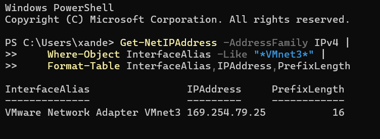
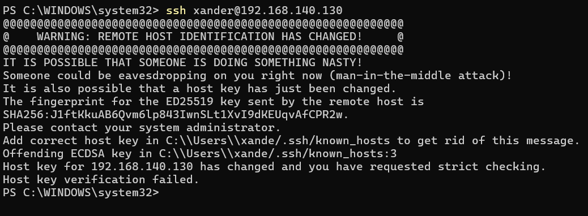
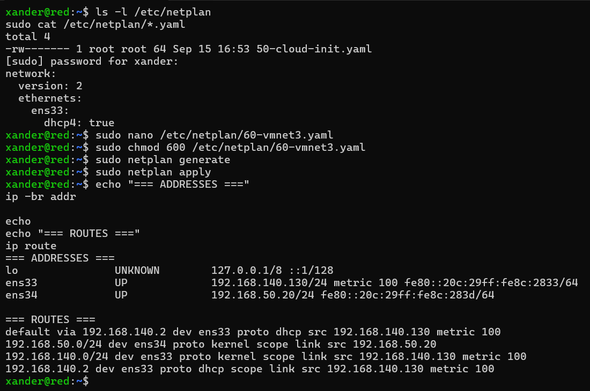

# VMware and network configuration

## VMware Workstation

The lab runs in VMware Workstation with two networking goals:

1. Internet/package access;
2. a deterministic private AS4 network.

## VMnet3

Custom host-only network:

```text
Name: VMnet3
Subnet: 192.168.50.0/24
DHCP: disabled
```

Windows host adapter:

```text
192.168.50.1/24
```

## VM interfaces

```text
ens33 = VMware NAT
ens34 = VMnet3 host-only
```

Blue:

```text
ens34 = 192.168.50.10/24
```

Red:

```text
ens34 = 192.168.50.20/24
```

## Why DHCP is disabled

The static addresses keep PMode endpoints, SSH targets and troubleshooting deterministic across reboots.

## SSH from Windows

```powershell
ssh xander@192.168.50.10
ssh xander@192.168.50.20
```

Windows SSH was the preferred management path during the Blue/Red phase.

## Blue -> Red pre-AS4 reachability

Ping:

```text
3/3 packets
0% loss
~0.85 ms average
```

Red root endpoint:

```text
http://192.168.50.20:8080/domibus/
```

returned:

```text
HTTP 302
```

Red MSH:

```text
http://192.168.50.20:8080/domibus/services/msh
```

returned:

```text
HTTP 200
```

## Red -> Blue reachability

Reverse connectivity was also confirmed. The final Red reboot validation reached Blue MSH with HTTP 200.

## Interpretation

An MSH GET returning 200 proves network and web-endpoint reachability. It does not prove AS4 routing, crypto, receipts or backend delivery; those are validated separately.

## Additional screenshot-derived network history

The screenshots capture an intermediate Windows-host issue that is useful for future troubleshooting: before the host-only adapter was manually corrected, `VMware Network Adapter VMnet3` showed an APIPA address (`169.254.79.25/16`). This is evidence of why the host adapter needed an explicit `192.168.50.1/24` configuration. The screenshots also show a cloned/recreated guest producing an SSH host-key change warning on Windows; the guest machine identity/host keys were regenerated as part of making the cloned VM a distinct host.

### Screenshot evidence


*VMnet3 configured as a custom host-only network on `192.168.50.0/24`.*



*Windows showing an APIPA `169.254.x.x` address on VMnet3 before the host adapter was corrected.*



*Windows OpenSSH detecting a changed host key after the VM clone/identity work.*



*Guest-side interface and routing verification during the static-network setup.*

