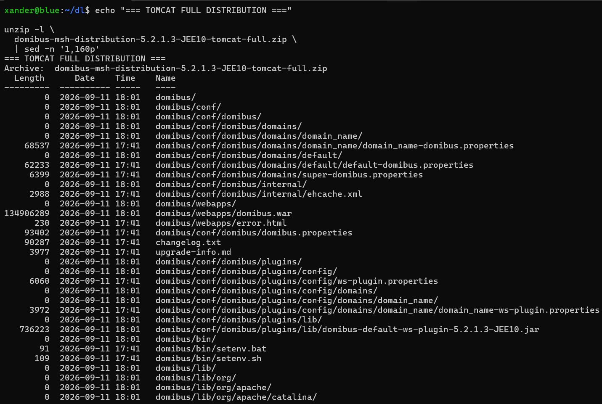
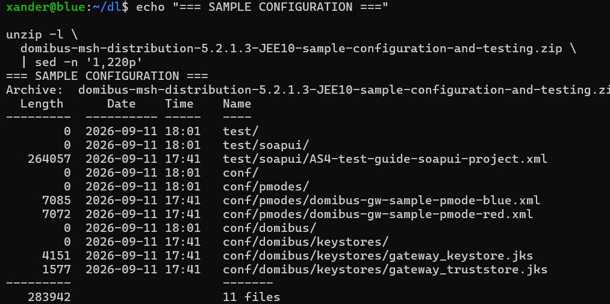
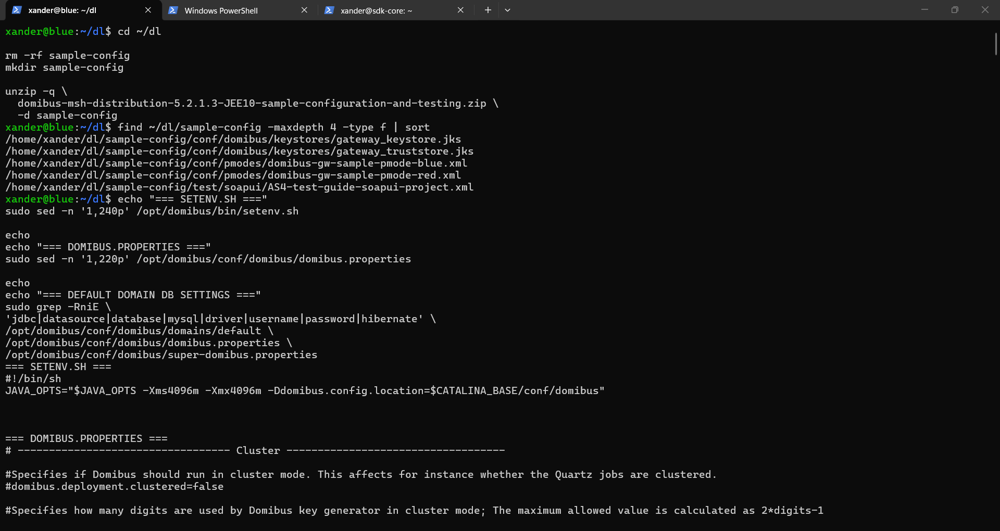
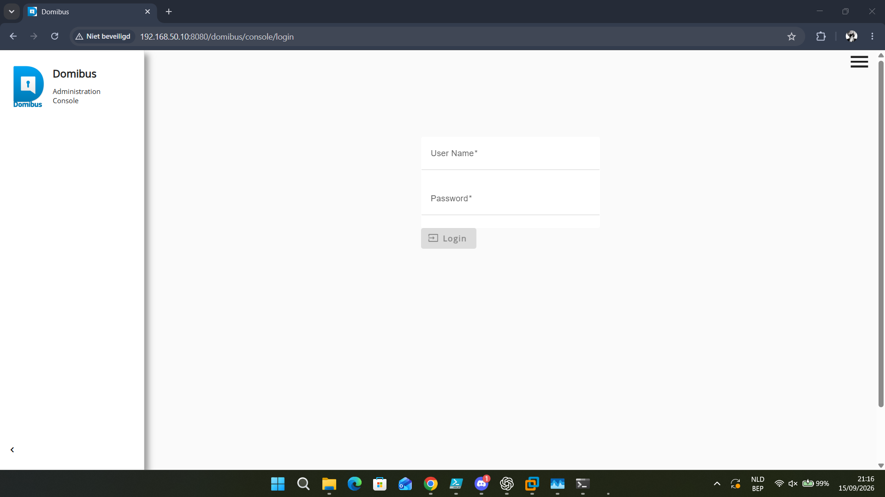

# Domibus installation

## Strategy

The installation was performed manually. No automated install script was used because the goal was to understand each layer and preserve troubleshooting context.

## Dedicated service account

```text
user: domibus
group: domibus
home: /opt/domibus
shell: /usr/sbin/nologin
```

Observed Red account entry:

```text
domibus:x:999:988::/opt/domibus:/usr/sbin/nologin
```

Observed group:

```text
domibus:x:988
```

Numeric IDs are not intended as portable requirements.

## Full distribution

```text
domibus-msh-distribution-5.2.1.3-JEE10-tomcat-full.zip
```

Extracted under:

```text
/opt/domibus
```

## Sample distribution

The sample/testing archive was extracted separately rather than over `/opt/domibus`, avoiding accidental overwrite of the live installation.

## JDBC driver

Connector/J was installed at:

```text
/opt/domibus/lib/mysql-connector-j-8.4.0.jar
```

## Ownership

The Domibus tree is owned by:

```text
domibus:domibus
```

## Important files

```text
/opt/domibus/bin/startup.sh
/opt/domibus/bin/shutdown.sh
/opt/domibus/bin/setenv.sh
/opt/domibus/webapps/domibus.war
/opt/domibus/conf/domibus/domibus.properties
/opt/domibus/conf/domibus/domains/default/default-domibus.properties
/opt/domibus/conf/domibus/super-domibus.properties
/opt/domibus/conf/domibus/keystores/gateway_keystore.jks
/opt/domibus/conf/domibus/keystores/gateway_truststore.jks
```

## Factory backup

A pristine properties copy was preserved as:

```text
/opt/domibus/conf/domibus/domibus.properties.factory
```

Mode:

```text
600
```

The active properties file was also protected with mode 600.

## Blue core configuration

```text
DB host: localhost
DB port: 3306
DB schema: domibus_schema
DB user: edelivery_user
driver: com.mysql.cj.jdbc.Driver
gateway alias: blue_gw
payload path: /data/domibus/payloads
temp path: /data/domibus/tmp
```

## Red core configuration

Same DB host/port/schema/driver model, but gateway alias:

```text
red_gw
```

Payload/temp paths are the same local paths.

## Final JDBC URL

```text
jdbc:mysql://${domibus.database.serverName}:${domibus.database.port}/${domibus.database.schema}?useSSL=false&useLegacyDatetimeCode=false&serverTimezone=UTC&allowPublicKeyRetrieval=true
```

## Manual start

```bash
cd /opt/domibus

sudo -u domibus env \
  JAVA_HOME=/usr/lib/jvm/temurin-21-jdk-amd64 \
  /opt/domibus/bin/startup.sh
```

## Manual stop

```bash
cd /opt/domibus

sudo -u domibus env \
  JAVA_HOME=/usr/lib/jvm/temurin-21-jdk-amd64 \
  /opt/domibus/bin/shutdown.sh
```

## Working-directory issue

An early Blue startup generated a FreeMarker-related warning. Restarting from `/opt/domibus` fixed it. The final systemd unit therefore explicitly sets `WorkingDirectory=/opt/domibus`.

## Payload manager

Logs confirmed initialization and use of:

```text
/data/domibus/payloads
```

## Health endpoints

Root:

```text
http://127.0.0.1:8080/domibus/
```

Healthy response:

```text
302
```

MSH:

```text
http://127.0.0.1:8080/domibus/services/msh
```

Healthy response:

```text
200
```

WS Plugin WSDL:

```text
http://127.0.0.1:8080/domibus/services/wsplugin?wsdl
```

Healthy response:

```text
200
```

## Important health lesson

A healthy Java/Tomcat process and open port 8080 do not guarantee the `/domibus` application deployed successfully. The first Blue cold reboot proved this.

## Screenshot-derived installation details

The screenshots record the contents of both the full Domibus distribution and the sample configuration/testing ZIP before installation. They also show the main properties being inspected/edited, the Tomcat/Java version checks, startup logging, and the first successful Admin Console page in a browser. The sample archive visibly contains the Blue and Red sample PMode XML files, gateway keystore/truststore files and `AS4-test-guide-soapui-project.xml`.

A startup log screenshot identifies the running build as `domibus-MSH Version [5.2.1.3-JEE10]` with a build time of `2026-09-11 15:00 UTC`. It also records a warning that the older WS Plugin endpoint form is deprecated in favor of `/wsplugin`; the lab kept using the WSDL-published endpoint that was proven to work for the test flow.

### Screenshot evidence



*Inspection of the Domibus full-distribution archive before deployment.*



*The sample ZIP containing PMode, keystore/truststore and SoapUI project material.*



*The supplied/default property set being reviewed before customization.*



*Browser evidence that the deployed Domibus web application was reachable.*


*Startup log showing the Domibus 5.2.1.3-JEE10 build and datasource initialization path.*

