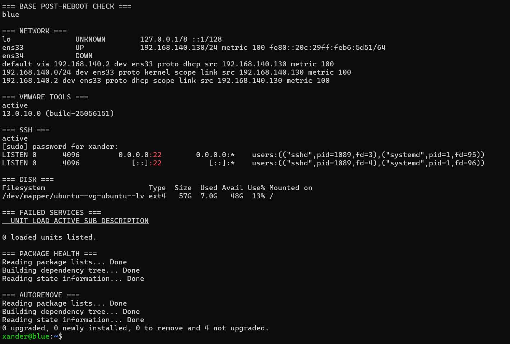
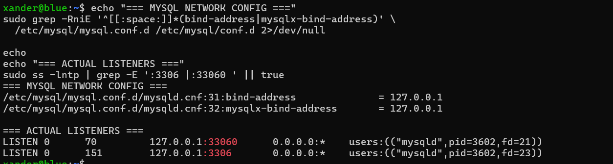
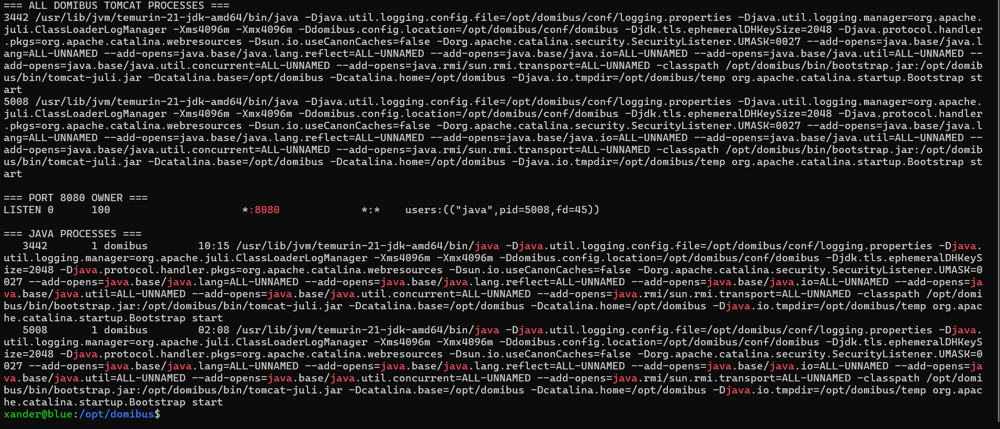

# Operations runbook

## 1. Confirm the machine

Always begin with:

```bash
hostname
```

Expected:

```text
blue
```

or:

```text
red
```

This rule exists because Red-preparation commands were once accidentally run on Blue.

## 2. Service status

```bash
systemctl is-enabled domibus
systemctl is-active domibus
sudo systemctl status domibus --no-pager -l
```

## 3. Java process

```bash
pgrep -a java
```

Then validate the actual Domibus PID:

```bash
PID=$(sudo cat /run/domibus/tomcat.pid 2>/dev/null)

if [ -n "$PID" ] && ps -p "$PID" >/dev/null 2>&1; then
    echo "[PASS] Domibus PID $PID is alive"
    ps -o user,group,pid,ppid,etime,cmd -p "$PID"
else
    echo "[FAIL] Domibus PID file missing or process not running"
fi
```

Expected owner:

```text
domibus domibus
```

## 4. Port 8080

```bash
sudo ss -ltnp | grep ':8080'
```

The socket PID should match the Domibus PID.

## 5. MySQL

```bash
systemctl is-active mysql
```

Expected:

```text
active
```

## 6. Data disk

```bash
findmnt /data
df -h /data
```

Expected source:

```text
/dev/sdb1
```

## 7. Application health

```bash
curl -sS -o /dev/null -w 'Root HTTP %{http_code}\n' \
  http://127.0.0.1:8080/domibus/

curl -sS -o /dev/null -w 'MSH HTTP %{http_code}\n' \
  http://127.0.0.1:8080/domibus/services/msh

curl -sS -o /dev/null -w 'WS Plugin HTTP %{http_code}\n' \
  'http://127.0.0.1:8080/domibus/services/wsplugin?wsdl'
```

Healthy baseline:

```text
Root 302
MSH 200
WS Plugin 200
```

## 8. Peer MSH

From Blue:

```bash
curl -sS -o /dev/null -w 'Red MSH HTTP %{http_code}\n' \
  http://192.168.50.20:8080/domibus/services/msh
```

From Red:

```bash
curl -sS -o /dev/null -w 'Blue MSH HTTP %{http_code}\n' \
  http://192.168.50.10:8080/domibus/services/msh
```

Expected:

```text
200
```

## 9. Restart

```bash
sudo systemctl restart domibus
```

Allow roughly 60-90 seconds for full webapp initialization before judging final health.

## 10. Stop

```bash
sudo systemctl stop domibus
sudo ss -ltnp | grep ':8080' || echo '[PASS] 8080 stopped'
```

## 11. Start

```bash
sudo systemctl start domibus
```

## 12. Logs

```bash
sudo tail -f /opt/domibus/logs/catalina.out
```

```bash
sudo tail -f /opt/domibus/logs/domibus.log
```

## 13. Trace a message

```bash
MID='<MESSAGE_ID>'
sudo grep -F "$MID" /opt/domibus/logs/domibus.log | tail -100
```

If rotation/location is uncertain:

```bash
sudo grep -RFn "$MID" /opt/domibus/logs 2>/dev/null | tail -100
```

## 14. Current-boot deployment/DB failure check

```bash
sudo journalctl -b --no-pager | \
grep -E 'Public Key Retrieval|Context \[/domibus\] startup failed' \
|| echo '[PASS] No Domibus database/deployment failure this boot'
```

## 15. Check JDBC URL

```bash
sudo grep '^domibus\.datasource\.url=' \
  /opt/domibus/conf/domibus/domibus.properties
```

Expected to contain:

```text
allowPublicKeyRetrieval=true
```

## 16. Check DB auth plugin

```bash
sudo mysql -NBe \
"SELECT user,host,plugin FROM mysql.user WHERE user='edelivery_user';"
```

Expected:

```text
caching_sha2_password
```

## 17. Decode the known sample payload

```bash
python3 - <<'PY'
import base64
v='PD94bWwgdmVyc2lvbj0iMS4wIiBlbmNvZGluZz0iVVRGLTgiPz4KPGhlbGxvPndvcmxkPC9oZWxsbz4='
print(base64.b64decode(v).decode())
PY
```

Expected:

```xml
<?xml version="1.0" encoding="UTF-8"?>
<hello>world</hello>
```

## 18. Reboot validation

After reboot, wait around 75 seconds and verify:

```text
hostname correct
systemd enabled
systemd active
Java alive
owner domibus
MySQL active
/data mounted
8080 listening
Root 302
MSH 200
WS Plugin 200
peer MSH 200
no current-boot DB/deployment failure
```

## Visual reference for runbook checks

The evidence archive shows the same classes of checks used by this runbook: `hostname`, `ip -br addr`, `lsblk`, `df`, service status, `ss -ltnp`, Java/Tomcat process inspection, MySQL listener verification, filesystem mount validation and application-log inspection.







