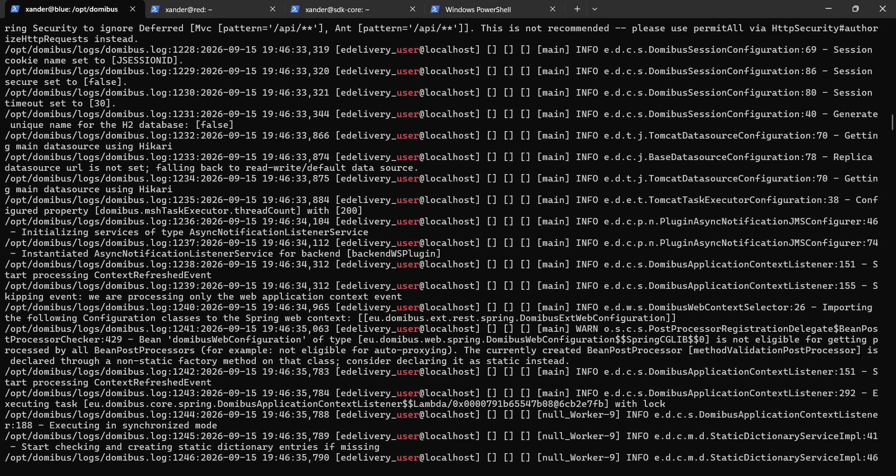

# Chronological build timeline

This timeline consolidates the retained milestones in order.

## Infrastructure phase

1. Create Ubuntu Server 24.04.5 VMs in VMware Workstation.
2. Give Blue/Red approximately 8 GB RAM, 4 processors, 60 GB OS disk and 200 GB data disk.
3. Create VMware host-only VMnet3 `192.168.50.0/24` with DHCP disabled.
4. Configure Windows VMnet3 adapter as `192.168.50.1/24`.
5. Configure Blue `ens34` as `192.168.50.10/24`.
6. Configure Red `ens34` as `192.168.50.20/24`.
7. Keep `ens33` on NAT.
8. Install/enable SSH.
9. Extend Ubuntu root LVM to approximately 57 GB.
10. Partition `/dev/sdb` as GPT `/dev/sdb1`, ext4, label `domibus-data`.
11. Mount at `/data` persistently by UUID.
12. Create Domibus payload/temp and staging directories.

## Runtime phase

13. Install Eclipse Temurin JDK 21.
14. Verify Java 21.0.12.1 Temurin.
15. Install MySQL.
16. Download Connector/J 8.4.0 and verify manifest.
17. Download Domibus 5.2.1.3 JEE10 Tomcat full distribution.
18. Download 5.2.1.3 sample configuration/testing ZIP.
19. Download SQL distribution 1.21.

## Database phase

20. Create `domibus_schema`.
21. Create `edelivery_user@localhost`.
22. Grant DB privileges plus `XA_RECOVER_ADMIN`.
23. Begin schema import.
24. Hit MySQL `ERROR 1419`.
25. Temporarily enable `log_bin_trust_function_creators=1`.
26. Complete DDL/data import.
27. Restore the setting to 0.
28. Validate 119 tables and `TB_VERSION.VERSION=5.2.1`.

## Blue Domibus phase

29. Create dedicated `domibus` user/group.
30. Extract Domibus to `/opt/domibus`.
31. Copy Connector/J into `/opt/domibus/lib`.
32. Preserve factory properties backup.
33. Configure MySQL datasource, alias `blue_gw`, payload/temp paths.
34. Verify Blue keystore/private alias.
35. Start Domibus manually.
36. Encounter working-directory/FreeMarker warning and stale-Java confusion.
37. Restart from `/opt/domibus` and verify healthy HTTP.
38. Recover Blue admin account after taking DB backup.
39. Change generated temporary admin password immediately.
40. Customize/upload Blue PMode.
41. Blue PMode DB ID becomes `887790301781046774` at `2026-09-15 20:01:42`.

## Red Domibus phase

42. Copy Domibus distribution/sample/Connector from Blue to Red.
43. Create Red `domibus` account and extract to `/opt/domibus`.
44. Configure Red datasource, alias `red_gw`, payload/temp paths.
45. Verify Red JKS private alias.
46. Start Red around 20:24; observed PID 2082.
47. Change generated Red admin password.
48. Customize/upload Red PMode.
49. Red final PMode ID becomes `887797339501778401` at `2026-09-15 20:29:40`.
50. Verify Blue <-> Red host-only reachability and MSH endpoints.

## WS Plugin discovery

51. Download exact WS Plugin WSDL on Blue.
52. Confirm SOAP 1.2 and target namespace `http://eu.domibus.wsplugin/`.
53. Inspect vendor SoapUI project; keep SoapUI itself out of the runtime toolchain.
54. Extract exact SOAP request from XML using Python.

## Blue -> Red AS4 test

55. First curl attempt fails due to path mangling; no request is sent.
56. Use absolute paths and submit successfully.
57. Receive HTTP 200 and MessageId `331c0511-b145-11f1-98c5-000c29b65d5b@domibus.eu`.
58. Blue entity ID `887799183390676475`.
59. Blue encrypts for `red_gw`, signs with `blue_gw`.
60. Red receives/persists payload as entity `887799205223657931`.
61. Red generates non-repudiation receipt.
62. Blue reliability check succeeds and status becomes `ACKNOWLEDGED`.
63. Red status is `RECEIVED`.
64. Extract `listPendingMessages` and `retrieveMessage` vendor requests.
65. Discover retrieve placeholder is `${ResponseParameter#messageID}`, not `${messageID}`.
66. Red lists exact message as pending.
67. Red retrieves payload successfully.
68. Base64 decodes to `<hello>world</hello>`.

## Red -> Blue AS4 test

69. Extract reverse `sendResponse` request.
70. Validate From `domibus-red`, To `domibus-blue`, correct service/action, no unresolved variables.
71. Submit successfully.
72. MessageId `f0209410-b146-11f1-a7a7-000c298c283d@domibus.eu`.
73. Red entity `887802313651713634`.
74. Blue receiver entity `887802330217584117`.
75. Red encrypts for `blue_gw`, signs with `red_gw`.
76. Blue receives/persists and returns receipt.
77. Red becomes `ACKNOWLEDGED`; Blue is `RECEIVED`.
78. Blue lists pending message and retrieves original payload.

## systemd phase

79. Create `domibus.service` on Blue.
80. Validate unit; enable/start.
81. Prove MainPID 4158 is Java, owned by `domibus`, listening on 8080, root 302.
82. Create identical service on Red.
83. Prove MainPID 4736 and equivalent healthy state.

## Blue reboot failure and fix

84. Reboot Blue.
85. systemd/Java/MySQL/data/8080 look healthy, but all `/domibus` URLs return 404.
86. Wait additional time; still 404.
87. Inspect logs.
88. Find `Public Key Retrieval is not allowed` and `/domibus` startup failure.
89. Confirm DB account uses `caching_sha2_password`.
90. Add `allowPublicKeyRetrieval=true` to active JDBC URL.
91. Initial broad edit also changes commented replica example; clean it up.
92. Restart Blue; root 302, MSH 200, WS Plugin 200.
93. Reboot Blue again.
94. Final Blue cold boot passes with PID 1215 and 70,531 ms deployment.

## Red reboot-proofing

95. Confirm Red DB user also uses `caching_sha2_password`.
96. Add `allowPublicKeyRetrieval=true` to Red active URL using targeted edit.
97. Warm restart passes with PID 6941 and 48,581 ms deployment.
98. Reboot Red.
99. Final Red cold boot passes with PID 1361 and 71,512 ms deployment.
100. Red reaches Blue MSH with HTTP 200 after reboot.

## Final state

Blue and Red are now:

```text
bidirectional AS4 proven
backend retrieval proven
systemd-managed
cold-reboot proven
```

## Screenshot timeline

A complete chronological screenshot index is available in [Screenshot evidence](24-screenshot-evidence.md). The archive materially improves the timeline by supplying visual checkpoints from VMware network creation at 17:54 through Domibus/admin diagnostics at 21:51.

Key milestones visible in the images include: VMnet3 creation, 60 GB SCSI OS disk provisioning, Ubuntu installation, `/cdrom` installation-medium issue, LVM expansion, base-service audit, guest identity regeneration, static networking, 200 GB data-disk setup, MySQL local binding, SQL import and `ERROR 1419`, successful 119-table schema state, Domibus distribution/sample inspection, Connector/J manifest verification, properties customization, first browser access, certificate inspection, PMode editing and admin DB recovery.




