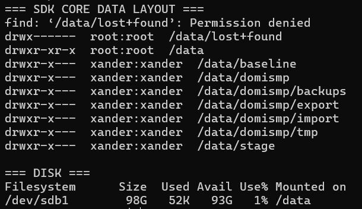

# sdk-core storage and data layout

## Why a separate `/data` disk was added

The `sdk-core` VM received a separate 100 GB SCSI disk so application state, logs, security material, imports/exports and backups are not mixed into the root filesystem. This mirrors the operational separation already used on Blue and Red.

## Final mount

```text
/dev/sdb1  ext4  label=sdk-core-data
UUID=f07b76d6-2fee-4add-8902-5503a6d2e603
mount=/data
```

`/etc/fstab` entry:

```text
UUID=f07b76d6-2fee-4add-8902-5503a6d2e603 /data ext4 defaults,nofail 0 2
```

Initial verification:

```text
/data /dev/sdb1 ext4 rw,relatime
/dev/sdb1 98G size, 24K used, 93G available, 1%
```

Cold-boot verification later showed:

```text
/data /dev/sdb1 ext4 rw,relatime
/dev/sdb1 98G 456K used 93G available 1%
```

## Initial directory layout

Before the DomiSMP service user existed, working directories were intentionally owned by `xander` so the package could be inspected without guessing future runtime ownership:

```text
/data/baseline
/data/domismp
/data/domismp/backups
/data/domismp/export
/data/domismp/import
/data/domismp/tmp
/data/stage
```

Mode was `750`.

A harmless observation during the first check was:

```text
find: '/data/lost+found': Permission denied
```

`lost+found` was correctly owned by `root:root`; permissions were not weakened to hide the message.

## Final DomiSMP data layout

After creating the dedicated `domismp` account, the persistent tree became:

```text
/data/domismp/
├── backups/
├── export/
├── ext-lib/
├── import/
├── locales/
├── logs/
├── security/
└── tmp/
```

Final observed ownership/mode:

```text
drwxr-x--- domismp:domismp /data/domismp
```

and the same owner/group/mode pattern for child directories.

## What each path is for

| Path | Purpose |
|---|---|
| `/data/domismp/logs` | DomiSMP application logs |
| `/data/domismp/security` | DomiSMP security/keystore/truststore area |
| `/data/domismp/ext-lib` | optional DomiSMP extension libraries |
| `/data/domismp/locales` | generated/updated UI and mail localisation files |
| `/data/domismp/import` | lab import staging |
| `/data/domismp/export` | lab export staging |
| `/data/domismp/backups` | local backups |
| `/data/domismp/tmp` | persistent lab temp area |
| `/data/baseline` | known-good baseline material |
| `/data/stage` | generic staging |

## Reboot proof

The systemd unit uses:

```ini
RequiresMountsFor=/data
```

This prevents DomiSMP from starting as if `/data` were available when the mount is missing.


