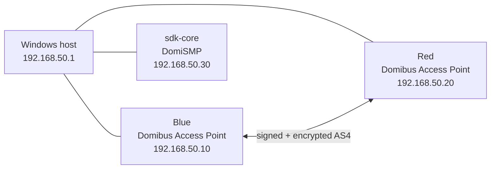

# Build it step by step

This page walks through the whole lab **in the order it was actually built**, from an empty Windows PC to three working VMs. Every step says:

- **What it is**: the thing you are about to create, in plain words;
- **Why**: why the lab needs it;
- **Do it**: downloads and commands;
- **Verify**: how you know it worked;
- **Went wrong for us**: a link to the failure, if there was one.

The detailed chapters (01–44) stay the deep reference. This guide links into them instead of repeating every value.

!!! note "Two kinds of commands on this page"
    **Observed** commands were used in the real build and are visible in the transcript or screenshots. **Reference** commands are the standard way to do a step whose exact command wasn't kept. They are marked as such. Passwords are always placeholders such as `<DB_PASSWORD>`. Never paste real secrets into this repository.

!!! info "Timestamps"
    Screenshot filenames (`20260915-HHMMSS.png`) use Windows local time (CEST, UTC+2). Domibus/DomiSMP log lines use UTC. A screenshot at `21:14` therefore shows log lines around `19:13`.

---

## 0. The picture in two minutes

The lab has three Ubuntu VMs on a private network:



| Term | Plain meaning |
|---|---|
| **AS4** | A standard for sending business documents between organisations over HTTP(S) and SOAP, with signing, encryption and delivery receipts. |
| **Access Point (AP)** | The "post office" server that sends and receives AS4 messages for an organisation. Blue and Red are two APs. |
| **Domibus** | The European Commission's free Access Point software. |
| **MSH** | Message Service Handler: the URL where one AP delivers to another (`/domibus/services/msh`). |
| **Backend / WS Plugin** | Your own application talks to Domibus through the WS Plugin SOAP API. In this lab, `curl` plays the backend. |
| **PMode** | An XML file that tells Domibus who the partners are, where they live and which security rules to use. |
| **SMP** | Service Metadata Publisher: a "phone book" saying where a participant can be reached. DomiSMP is the EC implementation. |
| **SDK** | *Säker digital kommunikation*, the Swedish secure-messaging federation run by Digg. It is **not** a "software development kit" here. |

More depth: [Concepts](domibus/01-concepts.md) and [SDK and DomiSMP concepts](sdk-core/01-concepts.md).

---

## 1. Windows host, VMware Workstation and the private network

**What it is.** VMware Workstation runs the VMs. **VMnet3** is a private "host-only" network that only the Windows host and the VMs can see.

**Why.** AS4 routing (the PMode) points at fixed IP addresses. A private network with static IPs keeps those addresses stable. Each VM also gets a second, NAT adapter for Internet downloads.

**Do it.**

1. Install VMware Workstation Pro (free for personal use; download through a Broadcom account): <https://www.vmware.com/products/desktop-hypervisor/workstation-and-fusion>
2. **Edit → Virtual Network Editor → Change Settings → Add Network → VMnet3**:
    - type **Host-only**;
    - subnet `192.168.50.0`, mask `255.255.255.0`;
    - **untick** "Use local DHCP service" (we use static IPs).
3. Give the Windows side of VMnet3 a fixed address. In an **elevated** PowerShell (reference command):

    ```powershell
    New-NetIPAddress -InterfaceAlias 'VMware Network Adapter VMnet3' `
      -IPAddress 192.168.50.1 -PrefixLength 24
    ```

    Or: Control Panel → Network Connections → *VMware Network Adapter VMnet3* → IPv4 → `192.168.50.1` / `255.255.255.0`, no gateway.

**Verify.**

```powershell
Get-NetIPAddress -AddressFamily IPv4 |
  Where-Object InterfaceAlias -Like "*VMnet3*" |
  Format-Table InterfaceAlias,IPAddress,PrefixLength
```

Expected: `192.168.50.1  24`.

**Went wrong for us.** The adapter first showed `169.254.79.25/16`. That is an APIPA "no DHCP answer" address, and it means sub-step 3 above hasn't been done yet. See [VMware and network](domibus/04-vmware-network.md#additional-screenshot-derived-network-history).


---

## 2. Create the Blue VM and install Ubuntu

**What it is.** The first Access Point, `blue`.

**Do it.**

1. Download **Ubuntu Server 24.04.5 LTS**: <https://releases.ubuntu.com/24.04/ubuntu-24.04.5-live-server-amd64.iso>
   (checksums: <https://releases.ubuntu.com/24.04/SHA256SUMS>).
2. VMware → **New Virtual Machine → Custom**:
    - 8 GB RAM, 4 processors;
    - SCSI controller **LSI Logic**, disk type **SCSI**, **60 GB**, stored as a single file;
    - network adapter 1 = **NAT**; add network adapter 2 = **Custom: VMnet3**.
3. Install Ubuntu with hostname `blue`, user `xander`, and **Install OpenSSH server** ticked.
4. When the installer finishes, **disconnect the ISO** (VM → Settings → CD/DVD → untick *Connected* and *Connect at power on*), then reboot.

**Verify.** Log in and run `hostname` (should print `blue`), `ip -br addr` and `lsblk`.

**Went wrong for us.** The installer printed `Failed unmounting cdrom.mount - /cdrom` and waited for the medium to be removed. Disconnecting the virtual CD fixes it. See [Ubuntu and storage](domibus/05-storage.md).


---

## 3. Use the whole OS disk (LVM)

**What it is.** Ubuntu puts `/` on an **LVM** logical volume, a resizable "virtual partition". By default the installer only uses about half of the 60 GB disk.

**Do it** (observed, screenshot `20260915-185903`):

```bash
sudo vgs                                              # free space in ubuntu-vg (~29 G)
sudo lvs
sudo lvextend -l +100%FREE -r /dev/ubuntu-vg/ubuntu-lv   # -r also grows the ext4 filesystem
```

**Verify.** `df -hT /` shows about **57 G**.


---

## 4. Updates, VMware tools and SSH from Windows

**Do it** (observed):

```bash
sudo apt update
sudo apt full-upgrade -y
systemctl is-active open-vm-tools        # VMware guest tools, preinstalled
systemctl is-active ssh
```

When a package asks *"Start Iperf3 as a daemon automatically?"*, the answer used was **No**.

From Windows:

```powershell
ssh xander@192.168.140.x     # NAT address from `ip -br addr` until step 6 is done
```

!!! tip
    Always run `hostname` before pasting a block of commands. In this build, a Red-preparation block was once run on Blue by mistake ([failure 11](domibus/15-failures-and-fixes.md#11-red-commands-accidentally-executed-on-blue)).

!!! success "Snapshot"
    Shut down and take the VMware snapshot `00-Base-OS-Clone-Ready` on Blue. Red is cloned from this state in the next step. See [VMware snapshots](reference/snapshots.md).


---

## 5. Make Red: clone Blue

**What it is.** The second Access Point. In the real build, Red was **cloned from Blue right after the Ubuntu base setup** (about 19:29 CEST), before networking, data disks, Java or Domibus. From here on, every step is done on **both** VMs, with Red-specific values where noted.

**Do it.**

1. Shut Blue down. VMware → **VM → Manage → Clone → Full clone**, name `red`.
2. Boot the clone and give it its own identity. The commands are reference commands; the result (new machine-id and host key) is visible in screenshot `20260915-192932`:

    ```bash
    sudo hostnamectl set-hostname red
    sudo rm -f /etc/machine-id && sudo systemd-machine-id-setup
    sudo rm -f /etc/ssh/ssh_host_* && sudo dpkg-reconfigure openssh-server
    cat /etc/machine-id
    sudo ssh-keygen -lf /etc/ssh/ssh_host_ed25519_key.pub
    ```

3. On Windows, forget the old host key before connecting. OpenSSH shows `REMOTE HOST IDENTIFICATION HAS CHANGED!` because the clone now has new keys. That is expected.

    ```powershell
    ssh-keygen -R <old-address>
    ```

**Verify.** `hostname` prints `red`, and Blue and Red show different `/etc/machine-id` values.

!!! note "Red-specific values used in later steps"
    | Setting | Blue | Red |
    |---|---|---|
    | `ens34` IP (step 6) | 192.168.50.10 | 192.168.50.20 |
    | Data-disk UUID (step 7) | generated | generated (different) |
    | `domibus.security.key.private.alias` (step 12) | `blue_gw` | `red_gw` |
    | Sample PMode (step 13) | `domibus-gw-sample-pmode-blue.xml` | `domibus-gw-sample-pmode-red.xml` |


Details: [Red gateway](domibus/11-red-gateway.md).

---

## 6. Static IP on the private network

**What it is.** `ens33` is the NAT adapter (Internet, via DHCP). `ens34` is the VMnet3 adapter, and it gets a fixed IP.

**Do it.** Create `/etc/netplan/60-vmnet3.yaml`. The filename, mode and commands were observed. The file body is the reference form of the observed result:

```yaml
network:
  version: 2
  ethernets:
    ens34:
      dhcp4: false
      addresses:
        - 192.168.50.10/24      # Red: .20, sdk-core: .30
```

```bash
sudo chmod 600 /etc/netplan/60-vmnet3.yaml
sudo netplan generate
sudo netplan apply
```

No gateway is set on `ens34`, so Internet traffic keeps using NAT.

**Verify.** `ip -br addr` shows `ens34 UP 192.168.50.10/24`, and Windows can run `ssh xander@192.168.50.10`.


---

## 7. Add the 200 GB data disk (`/data`)

**What it is.** A second virtual disk only for application data: payloads, temp files and backups. If the OS disk fills up or is rebuilt, the data survives separately.

Words used here:

- **GPT**: modern partition table;
- **ext4**: the Linux filesystem;
- **label**: a human-readable disk name;
- **UUID**: a unique ID, used in `/etc/fstab` because device names like `/dev/sdb` can change;
- **`nofail`**: boot continues even if the disk is missing, instead of dropping into emergency mode.

**Do it.**

1. VMware → VM Settings → **Add → Hard Disk → SCSI → 200 GB**.
2. In the VM (observed, screenshots `20260915-200824` … `201008`):

```bash
lsblk -o NAME,SIZE,TYPE,FSTYPE,MOUNTPOINTS,MODEL     # new disk appears as sdb

sudo parted -s /dev/sdb mklabel gpt
sudo parted -s /dev/sdb mkpart primary ext4 0% 100%
sudo mkfs.ext4 -L domibus-data /dev/sdb1

sudo mkdir -p /data
UUID=$(sudo blkid -s UUID -o value /dev/sdb1)
echo "UUID=$UUID /data ext4 defaults,nofail 0 2" | sudo tee -a /etc/fstab
sudo systemctl daemon-reload
sudo mount -a

sudo mkdir -p /data/domibus/payloads /data/domibus/tmp \
  /data/stage /data/baseline /data/garage /data/fs_plugin_data

sudo umount /data && sudo mount /data              # proves the fstab entry works
```

**Verify.** `findmnt /data` shows `/dev/sdb1 ext4 rw,relatime`, and `df -hT /data` shows about 196 G.

Ownership moves to the `domibus` user in step 12. Details: [Ubuntu and storage](domibus/05-storage.md).

!!! success "Snapshot"
    Shut down and take the VMware snapshot `01-Network-Storage-Ready` on Blue and on Red. See [VMware snapshots](reference/snapshots.md).


---

## 8. Java 21 (Eclipse Temurin)

**What it is.** Domibus and Tomcat are Java programs. Temurin is a free, well-maintained Java build.

**Do it.** Add the Adoptium apt repository (reference commands from <https://adoptium.net/installation/linux/>):

```bash
sudo apt install -y wget apt-transport-https gpg
wget -qO - https://packages.adoptium.net/artifactory/api/gpg/key/public \
  | gpg --dearmor | sudo tee /etc/apt/trusted.gpg.d/adoptium.gpg >/dev/null
echo "deb https://packages.adoptium.net/artifactory/deb $(awk -F= '/^VERSION_CODENAME/{print$2}' /etc/os-release) main" \
  | sudo tee /etc/apt/sources.list.d/adoptium.list
sudo apt update
sudo apt install -y temurin-21-jdk
```

**Verify.**

```bash
java -version        # openjdk version "21.0.12.1" ... Temurin
ls -d /usr/lib/jvm/temurin-21-jdk-amd64
```


---

## 9. MySQL 8.0

**What it is.** Domibus stores message metadata, users and the PMode in a database. Each Access Point has its **own** local MySQL.

**Do it** (reference):

```bash
sudo apt install -y mysql-server
```

**Verify** (observed):

```bash
sudo ss -lntp | grep -E ':3306 |:33060 '
```

Expected: listening on `127.0.0.1` only. The database is deliberately not reachable from the network.


---

## 10. Download Domibus 5.2.1.3

**What it is.** Four files:

| File | What it contains | Download |
|---|---|---|
| `domibus-msh-distribution-5.2.1.3-JEE10-tomcat-full.zip` (~145 MB) | Tomcat 10.1 with the Domibus WAR preinstalled | [download](https://ec.europa.eu/digital-building-blocks/artifact/repository/eDelivery/eu/domibus/domibus-msh-distribution/5.2.1.3-JEE10/domibus-msh-distribution-5.2.1.3-JEE10-tomcat-full.zip) |
| `domibus-msh-distribution-5.2.1.3-JEE10-sample-configuration-and-testing.zip` (~100 KB) | Sample Blue/Red PMode, test keystores, SoapUI test project | [download](https://ec.europa.eu/digital-building-blocks/artifact/repository/eDelivery/eu/domibus/domibus-msh-distribution/5.2.1.3-JEE10/domibus-msh-distribution-5.2.1.3-JEE10-sample-configuration-and-testing.zip) |
| `domibus-msh-sql-distribution-1.21.zip` (~1.7 MB) | Database creation scripts (MySQL folder `sql-scripts/5.2.1/mysql/`) | [download](https://ec.europa.eu/digital-building-blocks/artifact/repository/eDelivery/eu/domibus/domibus-msh-sql-distribution/1.21/domibus-msh-sql-distribution-1.21.zip) |
| `mysql-connector-j-8.4.0.jar` (~2.5 MB) | The JDBC driver so Java can talk to MySQL (not bundled by Domibus) | [download](https://repo1.maven.org/maven2/com/mysql/mysql-connector-j/8.4.0/mysql-connector-j-8.4.0.jar) |

Release page: <https://ec.europa.eu/digital-building-blocks/sites/spaces/DIGITAL/pages/467110244/Domibus>. Documentation: <https://docs.edelivery.tech.ec.europa.eu/domibus/5.2/>.

```bash
mkdir -p ~/dl && cd ~/dl
wget <each URL above>
mkdir sql-dist && unzip -q domibus-msh-sql-distribution-1.21.zip -d sql-dist
mkdir sample-config && unzip -q domibus-msh-distribution-5.2.1.3-JEE10-sample-configuration-and-testing.zip -d sample-config
```

The sample ZIP is unpacked **separately** so it can never overwrite the live installation.


---

## 11. Create the Domibus database

**Do it** (object names and grants observed; password is a placeholder):

```sql
-- sudo mysql
CREATE DATABASE domibus_schema;
CREATE USER 'edelivery_user'@'localhost' IDENTIFIED BY '<DB_PASSWORD>';
GRANT ALL PRIVILEGES ON domibus_schema.* TO 'edelivery_user'@'localhost';
GRANT XA_RECOVER_ADMIN ON *.* TO 'edelivery_user'@'localhost';
FLUSH PRIVILEGES;
```

Import the schema. MySQL blocks function creation while binary logging is on, so allow it for the import only:

```bash
sudo mysql -e "SET GLOBAL log_bin_trust_function_creators = 1;"
mysql -u edelivery_user -p domibus_schema < ~/dl/sql-dist/sql-scripts/5.2.1/mysql/mysql-5.2.1.ddl
mysql -u edelivery_user -p domibus_schema < ~/dl/sql-dist/sql-scripts/5.2.1/mysql/mysql-5.2.1-data.ddl
sudo mysql -e "SET GLOBAL log_bin_trust_function_creators = 0;"
```

**Verify** (observed):

```bash
mysql -u edelivery_user -p -D domibus_schema -e "
SELECT COUNT(*) FROM information_schema.tables WHERE table_schema='domibus_schema';
SELECT * FROM TB_VERSION;"
```

Expected: **119** tables and `VERSION 5.2.1`.

**Went wrong for us.** Without the temporary setting, the import failed with `ERROR 1419`. See [Database setup](domibus/08-database.md#import-failure-error-1419).


!!! success "Snapshot"
    Shut down and take the VMware snapshot `02-Domibus-DB-Ready` on Blue and on Red. See [VMware snapshots](reference/snapshots.md).


---

## 12. Install and configure Domibus (Blue, then Red)

**What it is.** Domibus runs inside Tomcat under `/opt/domibus`, as its own locked-down Linux user. It was done on Blue first; the downloaded files were then copied from Blue to Red and the same steps repeated there with `red_gw`.

**Do it** (reference for the account/extract commands; paths and results observed):

```bash
sudo useradd --system --home /opt/domibus --shell /usr/sbin/nologin --user-group domibus
sudo unzip -q ~/dl/domibus-msh-distribution-5.2.1.3-JEE10-tomcat-full.zip -d /opt
sudo cp ~/dl/mysql-connector-j-8.4.0.jar /opt/domibus/lib/
sudo chown -R domibus:domibus /opt/domibus /data/domibus
sudo chmod 750 /data/domibus /data/domibus/payloads /data/domibus/tmp

cd /opt/domibus/conf/domibus
sudo cp -p domibus.properties domibus.properties.factory   # pristine backup
sudo chmod 600 domibus.properties domibus.properties.factory
sudo nano domibus.properties
```

In `domibus.properties`, comment out the H2 lines and set the MySQL values:

```properties
domibus.database.serverName=localhost
domibus.database.port=3306
domibus.database.schema=domibus_schema

domibus.datasource.driverClassName=com.mysql.cj.jdbc.Driver
domibus.datasource.url=jdbc:mysql://${domibus.database.serverName}:${domibus.database.port}/${domibus.database.schema}?useSSL=false&useLegacyDatetimeCode=false&serverTimezone=UTC&allowPublicKeyRetrieval=true
domibus.datasource.user=edelivery_user
domibus.datasource.password=<DB_PASSWORD>

domibus.entityManagerFactory.jpaProperty.hibernate.dialect=org.hibernate.dialect.MySQLDialect

domibus.security.key.private.alias=blue_gw          # red_gw on Red
domibus.attachment.storage.location=/data/domibus/payloads
domibus.attachment.temp.storage.location=/data/domibus/tmp
```

!!! warning "Add `allowPublicKeyRetrieval=true` from the start"
    Our first build didn't have it. Everything worked until the first **reboot**, when Domibus returned 404 with `Public Key Retrieval is not allowed`. In plain words: MySQL 8's password method needs either TLS or permission for the driver to fetch the server's public key. With `useSSL=false`, you must allow the second. See [failure 17](domibus/15-failures-and-fixes.md#17-systemd-active-but-domibus-returned-404).

First manual start. It must be run **from `/opt/domibus`**:

```bash
cd /opt/domibus
sudo -u domibus env JAVA_HOME=/usr/lib/jvm/temurin-21-jdk-amd64 /opt/domibus/bin/startup.sh
sudo tail -f /opt/domibus/logs/catalina.out     # wait for "Server startup in [...] milliseconds"
```

**Verify.**

```bash
curl -sS -o /dev/null -w 'Root %{http_code}\n' http://127.0.0.1:8080/domibus/                 # 302
curl -sS -o /dev/null -w 'MSH %{http_code}\n'  http://127.0.0.1:8080/domibus/services/msh     # 200
```

From Windows, open <http://192.168.50.10:8080/domibus> to get the Admin Console login.

**Admin password.** On first start Domibus creates user `admin` with a random password and writes it to the log **once**:

```bash
sudo grep -RInaF 'Default password for user [admin] is' /opt/domibus/logs | tail -1
```

Log in and change the password immediately. Never screenshot or commit this log line.

**Went wrong for us.** Starting from another directory caused a FreeMarker warning. A leftover JVM caused confusion. Blue's admin account had to be recreated through the database. See [Domibus installation](domibus/07-installation.md) and [failures 2, 3 and 9](domibus/15-failures-and-fixes.md).


---

## 13. Certificates and PMode

**What it is.**

- The **keystore** (`gateway_keystore.jks`) holds private keys, used to **sign** outgoing messages and **decrypt** incoming ones.
- The **truststore** holds the partners' certificates, used to **encrypt** to them and **verify** their signatures.
- The **PMode** says "Blue is at this URL, Red is at that URL, use the `rsa` security profile".

!!! note "Lab shortcut: one shared sample keystore"
    The sample `gateway_keystore.jks` (store password `test123`, a public sample value) contains **both** private keys, `blue_gw` and `red_gw`. Both VMs use the same file, and `domibus.security.key.private.alias` selects which identity each one uses. That's fine for a lab. In production, each Access Point holds only its own private key.

**Check the stores** (observed):

```bash
sudo -u domibus keytool -list -v -storepass test123 \
  -keystore /opt/domibus/conf/domibus/keystores/gateway_keystore.jks | grep -E 'Alias name:|Entry type:|Owner:'
```

**Make the lab PMode** (observed):

```bash
mkdir -p ~/dl/pmodes
cp ~/dl/sample-config/conf/pmodes/domibus-gw-sample-pmode-blue.xml ~/dl/pmodes/domibus-gw-lab-blue.xml
nano ~/dl/pmodes/domibus-gw-lab-blue.xml
#   red_hostname  -> 192.168.50.20
#   blue_hostname -> 192.168.50.10
grep -n 'endpoint=' ~/dl/pmodes/domibus-gw-lab-blue.xml
grep -nE 'blue_hostname|red_hostname' ~/dl/pmodes/domibus-gw-lab-blue.xml || echo "[PASS] No placeholder hostnames remain"
python3 -c "import xml.etree.ElementTree as ET; ET.parse('/home/xander/dl/pmodes/domibus-gw-lab-blue.xml'); print('[PASS] XML is well-formed')"
```

Upload it in the Admin Console: **PMode → Current → Upload**. On Red, use the `…-red.xml` sample instead.


Details: [Cryptography and PMode](domibus/09-crypto-pmode.md).

!!! success "Snapshot"
    Shut down and take the VMware snapshot `03-Blue-PMode-Ready` / `03-Red-PMode-Ready`. See [VMware snapshots](reference/snapshots.md).


---

## 14. Send the first AS4 messages (both directions)

**What it is.** The real end-to-end test. A "backend" (here, `curl` on the same VM) submits a small XML file to Blue's WS Plugin. Blue signs and encrypts it and pushes it to Red. Red returns a signed receipt. Red's backend then lists and downloads the message.

**Do it** (all observed; full commands in [SOAP extraction and test commands](domibus/13-soap-test-commands.md)):

1. **Get the API description**:

    ```bash
    curl -fsS 'http://127.0.0.1:8080/domibus/services/wsplugin?wsdl' -o ~/dl/wsplugin-blue.wsdl
    ```

2. **Don't hand-write SOAP.** Extract the ready-made request envelopes from the vendor SoapUI project (`~/dl/sample-config/test/soapui/AS4-test-guide-soapui-project.xml`) with a small Python script. You don't need to install SoapUI.
3. **Submit on Blue**:

    ```bash
    curl -sS -o /home/xander/dl/blue-to-red-response.xml -w '\nHTTP %{http_code}\n' \
      -H 'Content-Type: application/soap+xml; charset=UTF-8; action="http://eu.domibus.wsplugin/WebServicePluginInterface/submitMessage"' \
      --data-binary @/home/xander/dl/blue-to-red-submit.xml \
      http://127.0.0.1:8080/domibus/services/wsplugin
    ```

    The response contains a `messageID`.
4. **Check states.**
    - In Blue's Admin Console → Messages, the message is `ACKNOWLEDGED` (the receipt came back).
    - In Red's Admin Console, it is `RECEIVED`.
5. **On Red, list and retrieve.** Call `listPendingMessages`, then `retrieveMessage`. In the retrieve request, replace the placeholder `${ResponseParameter#messageID}`, **not** `${messageID}`. Base64-decode the payload: it should be `<hello>world</hello>`.
6. Repeat Red → Blue with the vendor `sendResponse` request.

**Verify.** Both directions reach `ACKNOWLEDGED` on the sender and `RECEIVED` on the receiver, and the payload is retrieved. The proven IDs are in [Raw observed values](domibus/20-raw-values.md#blue-red-message).

!!! success "Snapshot"
    Shut down and take the VMware snapshot `04-Blue-AS4-Working` / `04-Red-AS4-Working`. See [VMware snapshots](reference/snapshots.md).


---

## 15. Run Domibus as a service and prove it survives a reboot

**What it is.** **systemd** starts Domibus automatically at boot, after MySQL and `/data` are ready. It uses `Type=forking` because Tomcat's `startup.sh` launches Java in the background and exits. The PID file tells systemd which process is the real service.

**Do it.**

1. Create `/etc/systemd/system/domibus.service`. The full unit is in [systemd and reboot](domibus/14-systemd-reboot.md#unit-file).
2. Run:

    ```bash
    sudo systemd-analyze verify /etc/systemd/system/domibus.service
    sudo systemctl daemon-reload
    sudo systemctl enable --now domibus
    sudo reboot
    ```

**Verify** about 75 seconds after boot. Use the full checklist in the [Operations runbook](domibus/17-runbook.md). The short version:

```bash
systemctl is-active domibus mysql
findmnt /data
curl -sS -o /dev/null -w 'Root %{http_code}\n' http://127.0.0.1:8080/domibus/                         # 302
curl -sS -o /dev/null -w 'WS %{http_code}\n'   'http://127.0.0.1:8080/domibus/services/wsplugin?wsdl'  # 200
```

!!! warning "Service active is not the same as Domibus healthy"
    After the first reboot, systemd, Java, MySQL and port 8080 all looked fine, but every `/domibus` URL returned **404**. The web application had failed to deploy. Always check the HTTP endpoints and `catalina.out`, not just `systemctl`.

!!! success "Snapshot"
    Shut down and take the VMware snapshot `05-Blue-Reboot-Safe` / `05-Red-Reboot-Safe`. See [VMware snapshots](reference/snapshots.md).


---

## 16. Create the sdk-core VM

**What it is.** A third VM for the discovery ("phone book") side: DomiSMP.

**Do it.** Repeat steps 2–9 (without cloning) with these differences:

| Setting | Value |
|---|---|
| Hostname | `sdk-core` |
| VMnet3 IP (`ens34`) | `192.168.50.30/24` |
| Data disk | **100 GB**, label `sdk-core-data`, mounted at `/data` |
| Directories | `/data/baseline`, `/data/stage`, `/data/domismp/{backups,export,import,tmp}` |

**Verify.** `findmnt /data` shows about 98 G. A `find: '/data/lost+found': Permission denied` message is normal, because that folder belongs to root.


Details: [sdk-core inventory](sdk-core/02-inventory.md) and [storage](sdk-core/03-storage.md).

!!! success "Snapshot"
    Shut down and take the VMware snapshot `01-Network-Ready` on sdk-core once its static IP works (before adding the data disk). See [VMware snapshots](reference/snapshots.md).


---

## 17. Install DomiSMP 5.2.1.3

**Downloads:**

| File | Download |
|---|---|
| `smp-5.2.1.3.war`: the application | [download](https://ec.europa.eu/digital-building-blocks/artifact/repository/eDelivery/eu/europa/ec/edelivery/smp/5.2.1.3/smp-5.2.1.3.war) |
| `smp-5.2.1.3-setup.zip`: DB scripts, sample config, Logback config | [download](https://ec.europa.eu/digital-building-blocks/artifact/repository/eDelivery/eu/europa/ec/edelivery/smp/5.2.1.3/smp-5.2.1.3-setup.zip) |
| Apache Tomcat 10.1.59 (DomiSMP isn't bundled with Tomcat) | [download](https://archive.apache.org/dist/tomcat/tomcat-10/v10.1.59/bin/apache-tomcat-10.1.59.tar.gz) |
| MySQL Connector/J 8.4.0 | [download](https://repo1.maven.org/maven2/com/mysql/mysql-connector-j/8.4.0/mysql-connector-j-8.4.0.jar) |

Release page: <https://ec.europa.eu/digital-building-blocks/sites/spaces/DIGITAL/pages/467117783/DomiSMP>. Documentation: <https://docs.edelivery.tech.ec.europa.eu/domismp/5.2/>.

### 17a. Database: create it as `utf8mb3` from the start

```sql
-- sudo mysql
CREATE DATABASE smp CHARACTER SET utf8mb3 COLLATE utf8mb3_unicode_ci;
CREATE USER 'smp'@'localhost' IDENTIFIED BY '<SMP_DB_PASSWORD>';
GRANT ALL PRIVILEGES ON smp.* TO 'smp'@'localhost';
```

```bash
cd ~/dl/domismp/setup/database-scripts
sudo mysql smp < mysql.ddl && sudo mysql smp < mysql-data.sql     # && = seed only if DDL succeeded
sudo mysql -NBe "SELECT COUNT(*) FROM information_schema.tables WHERE table_schema='smp';"   # 50
```

!!! warning "Why utf8mb3"
    With `utf8mb4`, the DDL fails at line 699: `ERROR 1071 Specified key was too long`. A unique index on a `varchar(1024)` column needs 4 bytes × 1024 = 4096 bytes, over MySQL's 3072-byte limit. With utf8mb3 it's exactly 3072. Our first run also ran the seed script after the failed DDL and left a half-built database. See [DomiSMP database](sdk-core/05-database.md).

### 17b. Tomcat, driver and settings

```bash
sudo useradd --system --home /opt/domismp --shell /usr/sbin/nologin --user-group domismp
sudo mkdir -p /opt/domismp
sudo tar -xzf ~/dl/domismp/apache-tomcat-10.1.59.tar.gz -C /opt/domismp --strip-components=1
sudo cp ~/dl/domismp/smp-5.2.1.3.war /opt/domismp/webapps/smp.war        # URL becomes /smp
sudo cp ~/dl/domismp/mysql-connector-j-8.4.0.jar /opt/domismp/lib/        # copy first, then chown
sudo mkdir -p /data/domismp/{logs,security,ext-lib,locales}
sudo chown -R domismp:domismp /opt/domismp /data/domismp
sudo chmod 750 /opt/domismp
```

Then configure these four files. The full contents are in [DomiSMP configuration](sdk-core/07-configuration.md):

| File | Purpose |
|---|---|
| `/opt/domismp/bin/setenv.sh` | Java path, PID file, heap `-Xms1024m -Xmx2048m` ([Tomcat runtime](sdk-core/06-tomcat-runtime.md#explicit-java-settings)) |
| `/opt/domismp/lib/smp.config.properties` | Tells DomiSMP to use the JNDI datasource and `/data/domismp/*` folders |
| `/opt/domismp/conf/context.xml` (mode **600**) | The JNDI datasource with the DB password. Back up `context.xml.factory` first. |
| `/opt/domismp/lib/smp-logback.xml` | Log paths set to **absolute** `/data/domismp/logs/...` |

### 17c. First start, UI and admin password

```bash
sudo -u domismp /opt/domismp/bin/configtest.sh
sudo -u domismp /opt/domismp/bin/startup.sh
sudo grep -E 'Deployment of web application archive.*smp.war|Server startup in' /opt/domismp/logs/catalina.out
```

Open <http://192.168.50.30:8080/smp/> from Windows. Log in as `system` with the vendor bootstrap password. Try it **once only**: five failed attempts lock the account for an hour. Change the password immediately (16–32 characters, with upper case, lower case, a digit and a symbol).


### 17d. systemd, reboot, snapshot

1. Create `/etc/systemd/system/domismp.service`. Use `ExecStop=/opt/domismp/bin/shutdown.sh 30 -force`, because a leftover thread kept the JVM alive on shutdown. Full unit: [DomiSMP systemd](sdk-core/09-systemd-reboot.md#final-unit).
2. Run `sudo systemctl enable --now domismp`, then `sudo reboot`, then re-check HTTP 200 on `/smp/`.
3. Power off cleanly and take the VMware snapshot **`02-domismp-installed`**. It's lowercase, unlike the other snapshots; use `NN-Title-Case` for new ones, see [naming convention](reference/snapshots.md#naming-convention-for-new-snapshots).

---

## 18. What's next

The generic DomiSMP is running, but it is **not yet configured for Swedish SDK**: no SDK domain, participants, SML/DNS or certificates. Continue with [Next SDK configuration](next-steps.md).

---

## Known-good checklist

| Check | Blue | Red | sdk-core |
|---|---|---|---|
| `hostname` | `blue` | `red` | `sdk-core` |
| `ens34` | 192.168.50.10 | 192.168.50.20 | 192.168.50.30 |
| `/data` mounted | 200 G | 200 G | 100 G |
| Service | `domibus` active | `domibus` active | `domismp` active |
| HTTP | `/domibus/` 302, MSH 200, WS 200 | same | `/smp/` 200 |
| Database | `domibus_schema`, 119 tables | same | `smp`, 50 tables |
| Proven | AS4 both ways + reboot | AS4 both ways + reboot | UI + reboot + snapshot |

Full values: [Known-good state (Blue/Red)](domibus/18-known-good-state.md) and [sdk-core known-good state](sdk-core/13-known-good-state.md).
