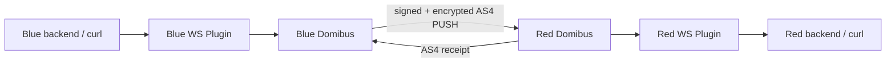
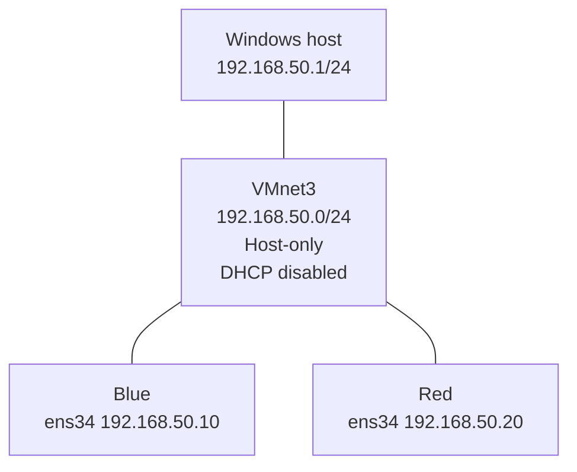
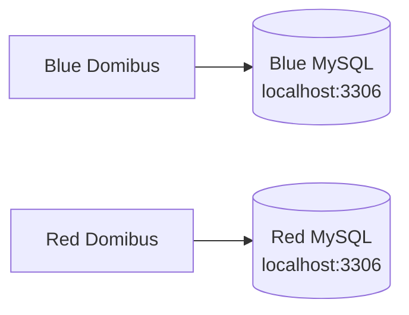
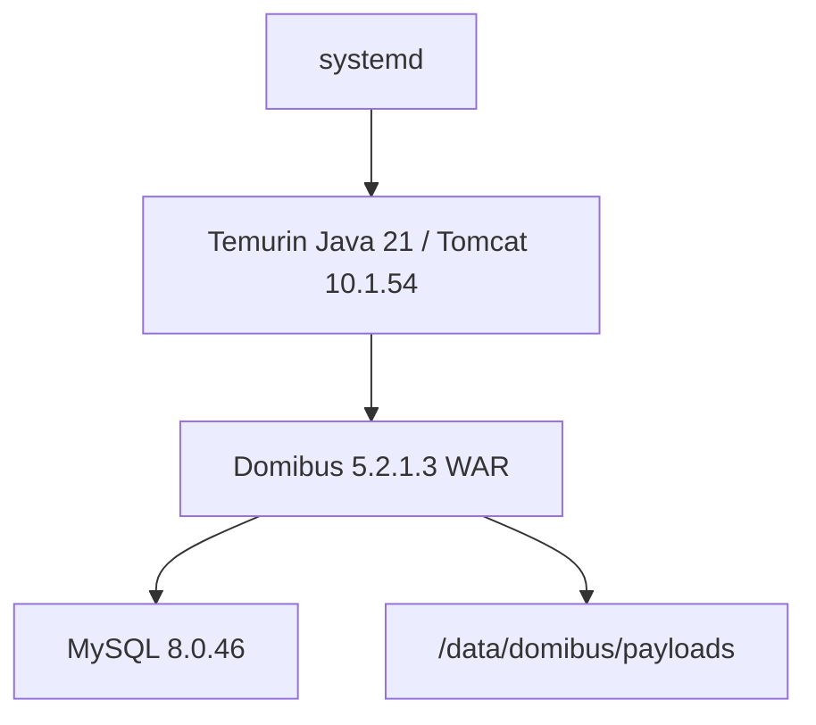
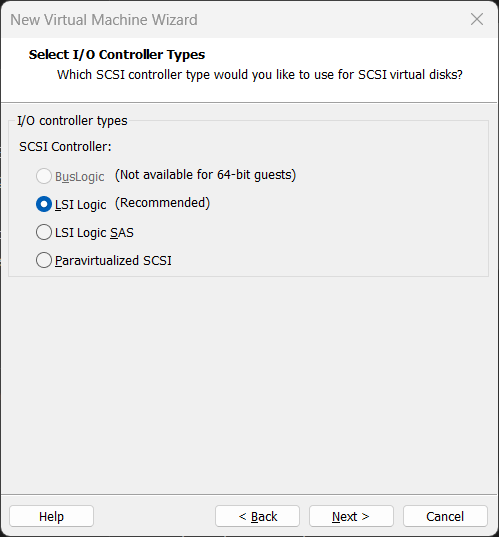
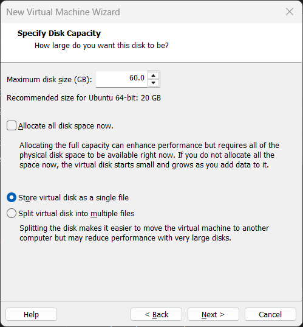

# Architecture

## Logical flow



The same components were proven in the opposite direction.

## Network



Each VM also has `ens33` attached to VMware NAT for downloads and package installation.

## Interface roles

```text
ens33 = VMware NAT
ens34 = VMnet3 host-only AS4/lab network
```

## Database topology

Each access point has its own MySQL instance and database.



No shared database exists between Blue and Red.

## Storage topology

Each gateway has an approximately 60 GB OS disk plus a separate approximately 200 GB data disk.

The data disk is mounted at:

```text
/data
```

Domibus payloads:

```text
/data/domibus/payloads
```

Temporary storage:

```text
/data/domibus/tmp
```

## Runtime stack



## Health-model lesson

The first Blue reboot proved that all of the following can be true:

```text
systemd active
Java alive
port 8080 listening
MySQL active
/data mounted
```

while Domibus itself is broken. The webapp failed to deploy and returned HTTP 404 because the DB authentication step failed.

Therefore final health means:

```text
process health
+ database health
+ filesystem health
+ application endpoint health
```

## Screenshot-derived architecture evidence

The VMware screenshots confirm that the private AS4 network was implemented as a dedicated custom VMnet rather than as an abstract diagram only. The VM creation screenshots also show the use of SCSI virtual disks and a 60 GB OS disk, while later terminal screenshots show the independent 200 GB data disk used for `/data`.

### Screenshot evidence


*VMware Virtual Network Editor with the custom VMnet3 `192.168.50.0/24` network.*



*VM creation using the recommended LSI Logic SCSI controller.*



*The VM wizard configuring a 60 GB virtual disk as a single file.*

