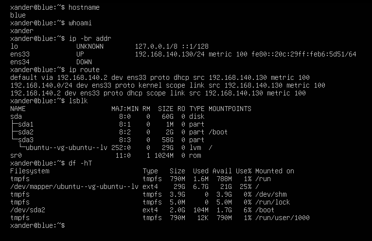
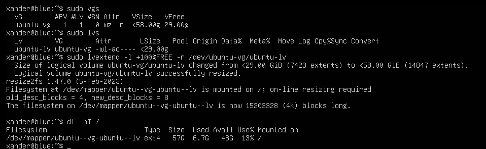
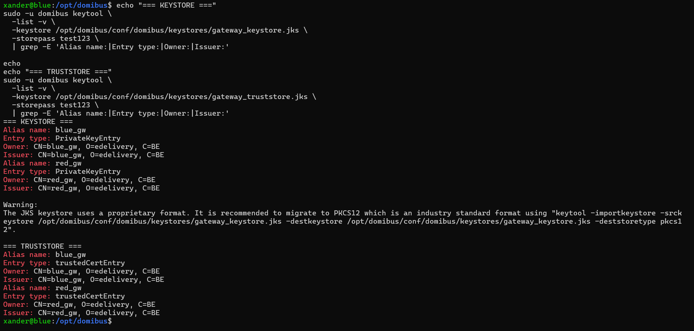
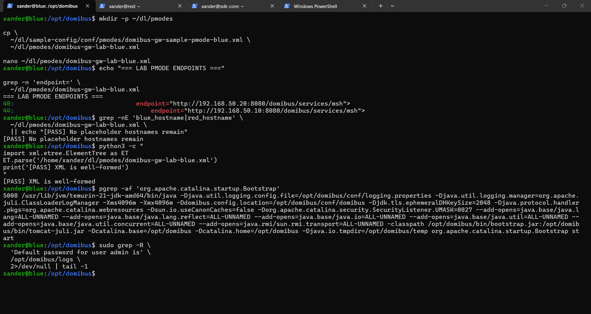

# Blue gateway

## Identity

```text
Hostname: blue
VMnet3: 192.168.50.10/24
Role: first Domibus Access Point
```

## Resources

```text
8 GB RAM
4 processors
60 GB OS disk
200 GB data disk
```

## Network

```text
ens33 = NAT
ens34 = 192.168.50.10/24
```

## Storage

Data partition:

```text
/dev/sdb1
ext4
label domibus-data
```

UUID:

```text
beb019ea-7a39-4095-8755-07b76de94779
```

Mount:

```text
/data
```

Directories:

```text
/data/domibus/payloads
/data/domibus/tmp
/data/stage
/data/baseline
/data/garage
/data/fs_plugin_data
```

## Java

```text
Eclipse Temurin JDK 21
JAVA_HOME=/usr/lib/jvm/temurin-21-jdk-amd64
```

## MySQL

```text
DB: domibus_schema
user: edelivery_user@localhost
schema version: 5.2.1
tables: 119
```

## Domibus

Installed under:

```text
/opt/domibus
```

Dedicated user:

```text
domibus
```

Connector/J:

```text
/opt/domibus/lib/mysql-connector-j-8.4.0.jar
```

## Blue properties

```text
server: localhost
port: 3306
schema: domibus_schema
driver: com.mysql.cj.jdbc.Driver
user: edelivery_user
alias: blue_gw
payload: /data/domibus/payloads
temp: /data/domibus/tmp
```

Final JDBC URL:

```text
jdbc:mysql://${domibus.database.serverName}:${domibus.database.port}/${domibus.database.schema}?useSSL=false&useLegacyDatetimeCode=false&serverTimezone=UTC&allowPublicKeyRetrieval=true
```

## First-start problems

An early Blue start produced a FreeMarker/working-directory warning. Restarting from `/opt/domibus` fixed it.

A stale JVM was also encountered during early startup troubleshooting. Later validation used the actual PID file and port owner rather than trusting the first `pgrep` result.

## Admin recovery

Blue's admin account required recovery through the database.

Backup:

```text
~/dl/backups/blue-before-admin-reset.sql
```

Approximate size:

```text
214 KB
```

Domibus recreated the admin user and logged a temporary generated password. The value is intentionally omitted and was changed immediately.

## PMode

File:

```text
~/dl/pmodes/domibus-gw-lab-blue.xml
```

Endpoints:

```text
Blue: http://192.168.50.10:8080/domibus/services/msh
Red:  http://192.168.50.20:8080/domibus/services/msh
```

PMode ID:

```text
887790301781046774
```

## Accidental Red commands on Blue

A Red preparation block was accidentally executed on Blue. It recopied Connector/J, recursively set `/opt/domibus` ownership, recreated/chowned/chmodded data directories, and performed a write test. These actions were effectively idempotent in the existing Blue state.

A full audit confirmed:

```text
hostname blue
ens34 192.168.50.10
Java correct
/data mounted
private alias blue_gw
DB 5.2.1
119 tables
PMode retained
```

No meaningful damage was found.

## Messaging results (summary)

| Test | Blue's role | Result |
|---|---|---|
| Blue -> Red | sender | `ACKNOWLEDGED`; encrypted for `red_gw`, signed with `blue_gw` |
| Red -> Blue | receiver | `RECEIVED`; receipt generated; WS Plugin notified |
| Backend on Blue | `listPendingMessages` + `retrieveMessage` | original `<hello>world</hello>` payload recovered |

Message IDs, entity IDs and full log evidence: [AS4 validation](12-as4-validation.md) and [Raw observed values](20-raw-values.md#blue-red-message).

## systemd and reboot (summary)

1. First systemd start: healthy (Main PID 4158, root HTTP 302).
2. **First cold reboot failed:** systemd, Java, MySQL, `/data` and port 8080 all looked healthy, but `/domibus`, MSH and WS Plugin returned **404**. The log showed `Public Key Retrieval is not allowed`.
3. Fix: `allowPublicKeyRetrieval=true` added to the active JDBC URL. The first broad `sed` also touched a commented replica line, which was cleaned up so the active count was exactly 1.
4. Warm restart and a second cold reboot then passed (root 302, MSH 200, WS Plugin 200).

Full sequence, PIDs and deployment timings: [systemd and reboot validation](14-systemd-reboot.md#blue-first-reboot).

## Screenshot evidence from the Blue build

The screenshot archive gives a nearly continuous visual history of Blue: initial hostname/interface/disk audit, LVM expansion, software/service verification, data-disk creation, MySQL schema import, Domibus archive inspection, properties customization, first startup, Admin Console reachability, process/port checks, certificate inspection, PMode preparation and the later admin-account database recovery.










