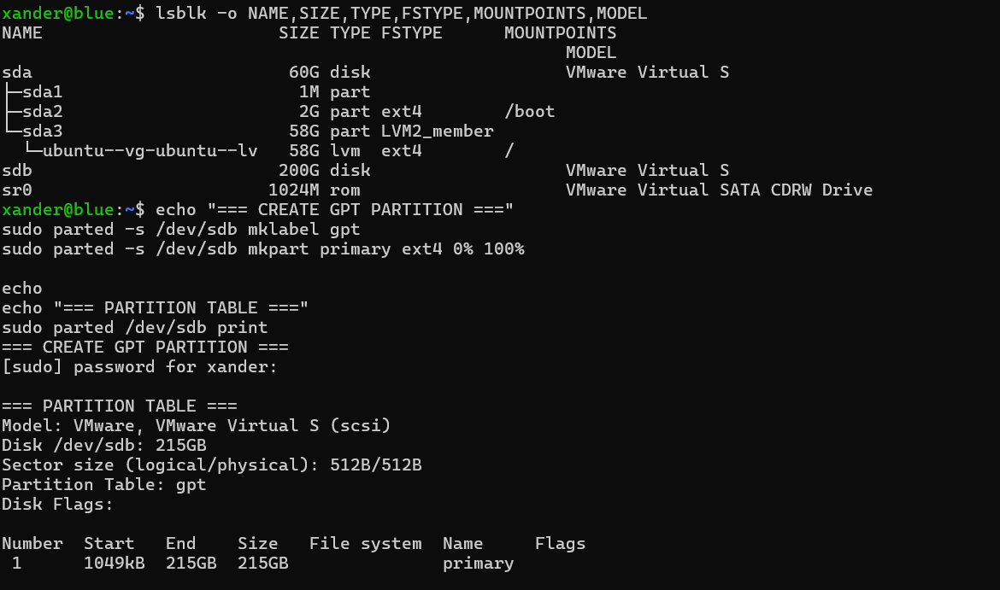

# Commands

This file collects the exact command patterns that became part of the known-good operating procedure.

## Confirm host

```bash
hostname
```

## Manual Domibus start

```bash
cd /opt/domibus
sudo -u domibus env \
  JAVA_HOME=/usr/lib/jvm/temurin-21-jdk-amd64 \
  /opt/domibus/bin/startup.sh
```

## Manual Domibus stop

```bash
cd /opt/domibus
sudo -u domibus env \
  JAVA_HOME=/usr/lib/jvm/temurin-21-jdk-amd64 \
  /opt/domibus/bin/shutdown.sh
```

## systemd status

```bash
systemctl is-enabled domibus
systemctl is-active domibus
sudo systemctl status domibus --no-pager -l
```

## Java/PID/socket

```bash
PID=$(sudo cat /run/domibus/tomcat.pid 2>/dev/null)
ps -o user,group,pid,ppid,etime,cmd -p "$PID"
sudo ss -ltnp | grep ':8080'
```

## Health endpoints

```bash
curl -sS -o /dev/null -w 'Root HTTP %{http_code}\n' \
  http://127.0.0.1:8080/domibus/

curl -sS -o /dev/null -w 'MSH HTTP %{http_code}\n' \
  http://127.0.0.1:8080/domibus/services/msh

curl -sS -o /dev/null -w 'WS Plugin HTTP %{http_code}\n' \
  'http://127.0.0.1:8080/domibus/services/wsplugin?wsdl'
```

## Peer MSH

Blue -> Red:

```bash
curl -sS -o /dev/null -w 'Red MSH HTTP %{http_code}\n' \
  http://192.168.50.20:8080/domibus/services/msh
```

Red -> Blue:

```bash
curl -sS -o /dev/null -w 'Blue MSH HTTP %{http_code}\n' \
  http://192.168.50.10:8080/domibus/services/msh
```

## Trace a message

```bash
MID='<MESSAGE_ID>'
sudo grep -F "$MID" /opt/domibus/logs/domibus.log | tail -100
```

Fallback:

```bash
sudo grep -RFn "$MID" /opt/domibus/logs 2>/dev/null | tail -100
```

## DB user plugin

```bash
sudo mysql -NBe \
"SELECT user,host,plugin FROM mysql.user WHERE user='edelivery_user';"
```

## Active JDBC URL

```bash
sudo grep '^domibus\.datasource\.url=' \
  /opt/domibus/conf/domibus/domibus.properties
```

## Current-boot failure check

Tomcat deployment messages are written to `catalina.out`, not the systemd journal. See [Operations runbook §14](17-runbook.md#14-current-boot-deploymentdb-failure-check).

```bash
sudo grep -E 'Public Key Retrieval|Context \[/domibus\] startup failed|Server startup in' \
  /opt/domibus/logs/catalina.out | tail -20
```

Healthy: the last line is `Server startup in [...] milliseconds`.

## Blue -> Red submit

```bash
curl -sS \
  -D /home/xander/dl/blue-to-red-response.headers \
  -o /home/xander/dl/blue-to-red-response.xml \
  -w '\nHTTP %{http_code}\n' \
  -H 'Content-Type: application/soap+xml; charset=UTF-8; action="http://eu.domibus.wsplugin/WebServicePluginInterface/submitMessage"' \
  --data-binary @/home/xander/dl/blue-to-red-submit.xml \
  http://127.0.0.1:8080/domibus/services/wsplugin
```

## listPendingMessages action

```text
http://eu.domibus.wsplugin/WebServicePluginInterface/listPendingMessages
```

## retrieveMessage action

```text
http://eu.domibus.wsplugin/WebServicePluginInterface/retrieveMessage
```

## Sample placeholder used by vendor project

```text
${ResponseParameter#messageID}
```

## Correct privileged `/proc/<pid>/environ` read

```bash
sudo sh -c "tr '\0' '\n' < /proc/$PID/environ"
```

## Screenshot-backed command reference




