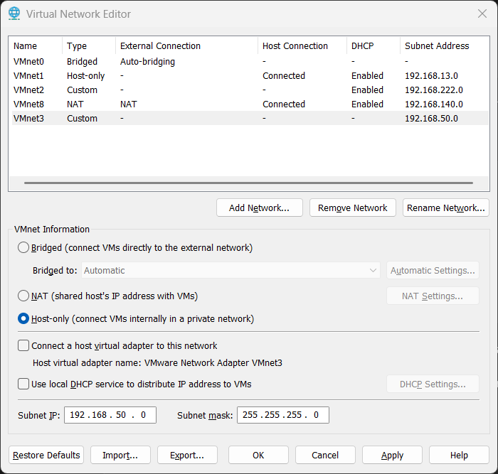
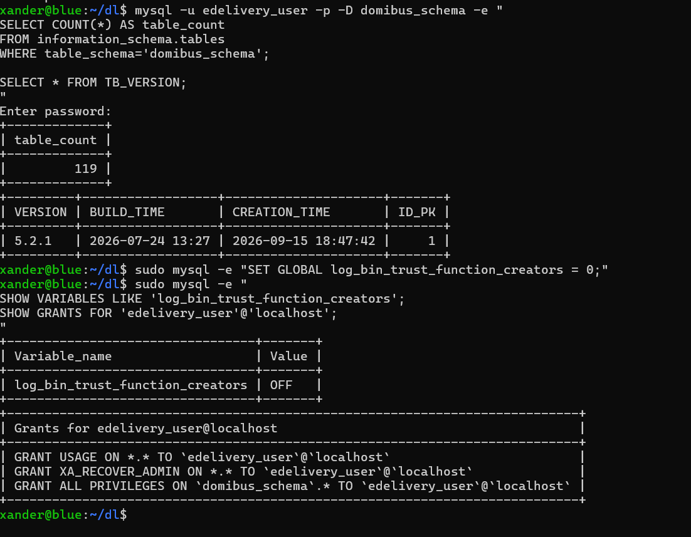
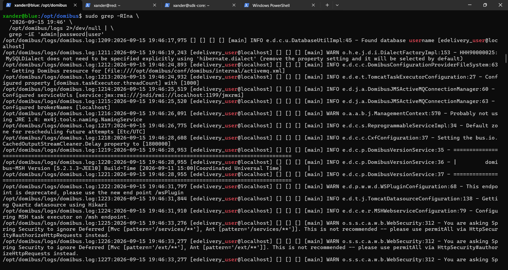

# Raw values

This chapter centralizes low-level values observed during the build so they are not lost inside narrative chapters.

## Network

```text
VMnet3 subnet: 192.168.50.0/24
VMnet3 DHCP: disabled
Windows VMnet3: 192.168.50.1/24
Blue ens34: 192.168.50.10/24
Red ens34: 192.168.50.20/24
Observed Red ens33 NAT: 192.168.140.130/24
```

## Data-disk UUIDs

```text
Blue: beb019ea-7a39-4095-8755-07b76de94779
Red:  559ba590-135c-4742-b1ce-583ab200b086
```

## fstab pattern

```text
UUID=<UUID> /data ext4 defaults,nofail 0 2
```

## Software versions

```text
Ubuntu Server: 24.04.5 LTS
Python: 3.12.3
open-vm-tools: 13.0.10.0
Java: Eclipse Temurin 21.0.12.1, 2026-08-18 LTS
Domibus: 5.2.1.3
Tomcat: 10.1.54
MySQL: 8.0.46 Ubuntu
Connector/J: 8.4.0
SQL distribution: 1.21
```

## Distribution filenames

```text
domibus-msh-distribution-5.2.1.3-JEE10-tomcat-full.zip
domibus-msh-distribution-5.2.1.3-JEE10-sample-configuration-and-testing.zip
domibus-msh-sql-distribution-1.21.zip
mysql-connector-j-8.4.0.jar
```

## Approximate observed file sizes

```text
Full Domibus ZIP: ~145 MB
Sample ZIP: ~100 KB
SQL ZIP: ~1.7 MB
Domibus WAR: ~129 MB
Connector JAR: ~2.5 MB
domibus.properties: ~92 KB
Gateway keystore: ~4.1 KB
Blue DB backup before admin reset: ~214 KB
WS Plugin WSDL: ~46 KB
```

## Java path/options

```text
JAVA_HOME=/usr/lib/jvm/temurin-21-jdk-amd64
-Xms4096m
-Xmx4096m
-Ddomibus.config.location=/opt/domibus/conf/domibus
```

## Database

```text
DB name: domibus_schema
DB user: edelivery_user@localhost
Authentication plugin: caching_sha2_password
Table count: 119
TB_VERSION.VERSION: 5.2.1
```

## DB privileges

```text
ALL PRIVILEGES ON domibus_schema.*
XA_RECOVER_ADMIN ON *.*
```

## Active final JDBC URL

```text
jdbc:mysql://${domibus.database.serverName}:${domibus.database.port}/${domibus.database.schema}?useSSL=false&useLegacyDatetimeCode=false&serverTimezone=UTC&allowPublicKeyRetrieval=true
```

## Crypto identities

```text
Blue alias: blue_gw
Red alias: red_gw
Blue subject: CN=blue_gw,O=edelivery,C=BE
Red subject: CN=red_gw,O=edelivery,C=BE
Blue observed serial: 1724922034
Red observed serial: 1724922226
Security profile: rsa
```

## PMode values

```text
Service value: bdx:noprocess
Service type: tc1
Internal service name: testService1
Action value: TC1Leg1
Internal action name: tc1Action
Leg: pushTestcase1tc1Action
Agreement: null in the observed exchange
Processing: PUSH
```

## PMode database IDs

Blue:

```text
ID: 887790301781046774
creation/modification: 2026-09-15 20:01:42
created by: admin
modified by: admin
```

Red initial/default:

```text
887795942874043123
```

Red final:

```text
ID: 887797339501778401
creation/modification: 2026-09-15 20:29:40
created by: admin
modified by: admin
```

## Blue -> Red message

```text
MessageId: 331c0511-b145-11f1-98c5-000c29b65d5b@domibus.eu
Blue messageEntityID: 887799183390676475
Red messageEntityID: 887799205223657931
ConversationId: 332db852-b145-11f1-98c5-000c29b65d5b@domibus.eu
Timestamp in retrieved UserMessage: 2026-09-15T20:36:59.000Z
Sender PartyId: domibus-blue
Receiver PartyId: domibus-red
OriginalSender: urn:oasis:names:tc:ebcore:partyid-type:unregistered:C1
FinalRecipient: urn:oasis:names:tc:ebcore:partyid-type:unregistered:C4
MSH role on receiver: RECEIVING
Payload CID: cid:message
Payload size: 59 bytes
Payload content type: text/xml
Retrieved filename: 062db1df-aa6f-49a9-9623-edeb3f4b24a5.payload
Sender final state: ACKNOWLEDGED
Receiver state: RECEIVED
```

## Red -> Blue message

```text
MessageId: f0209410-b146-11f1-a7a7-000c298c283d@domibus.eu
Red messageEntityID: 887802313651713634
Blue messageEntityID: 887802330217584117
ConversationId: f021f3a1-b146-11f1-a7a7-000c298c283d@domibus.eu
Timestamp in retrieved UserMessage: 2026-09-15T20:49:26.000Z
Sender PartyId: domibus-red
Receiver PartyId: domibus-blue
OriginalSender: urn:oasis:names:tc:ebcore:partyid-type:unregistered:C1
FinalRecipient: urn:oasis:names:tc:ebcore:partyid-type:unregistered:C4
MSH role on receiver: RECEIVING
Payload CID: cid:message
Payload size: 59 bytes
Payload content type: text/xml
Retrieved filename: 0cd9843c-2d64-4b9f-aa6d-ae5c8e3e7f03.payload
Sender final state: ACKNOWLEDGED
Receiver state: RECEIVED
```

## Party role URIs

```text
Sender role:
http://docs.oasis-open.org/ebxml-msg/ebms/v3.0/ns/core/200704/sender

Receiver role:
http://docs.oasis-open.org/ebxml-msg/ebms/v3.0/ns/core/200704/receiver
```

## Default MPC observed in retrieval

```text
http://docs.oasis-open.org/ebxml-msg/ebms/v3.0/ns/core/200704/defaultMPC
```

## Payload Base64

```text
PD94bWwgdmVyc2lvbj0iMS4wIiBlbmNvZGluZz0iVVRGLTgiPz4KPGhlbGxvPndvcmxkPC9oZWxsbz4=
```

Decoded:

```xml
<?xml version="1.0" encoding="UTF-8"?>
<hello>world</hello>
```

## Observed process IDs during the project

These PIDs are historical evidence only; they change every start/reboot.

```text
Blue earlier healthy manual check: 1896
Red first manual start: 2082
Blue first systemd start: 4158
Red first systemd start: 4736
Blue failed first cold-boot Tomcat PID: 1179
Blue warm restart after JDBC fix: 1868
Blue final cold-boot PID: 1215
Red warm restart after JDBC fix: 6941
Red final cold-boot PID: 1361
```

## Observed deployment durations

```text
27,306 ms
33,032 ms
40,798 ms
45,120 ms
48,581 ms
55,882 ms
70,531 ms
71,512 ms
```

## Important timestamps

Three clocks appear in this project:

- **UTC**: Domibus/Tomcat log lines and MySQL `CREATION_TIME` columns. For example, the Blue admin row created at `19:46:36` in the DB matches the screenshot taken at `21:47` local.
- **Windows local time (CEST, UTC+2)**: screenshot filenames.
- **Not recorded**: some transcript values whose source clock was not captured.

```text
Blue PMode upload:                          2026-09-15 20:01:42 UTC (DB timestamp)
Red PMode upload:                           2026-09-15 20:29:40 UTC (DB timestamp)
Blue -> Red submit:                         2026-09-15 ~20:36:59-20:37:05 UTC
Red -> Blue submit:                         2026-09-15 ~20:49:26-20:49:30 UTC
Blue first systemd start:                   2026-09-15 20:56:40 UTC
Red first systemd start:                    2026-09-15 21:00:21 UTC
Blue failed reboot Domibus deploy:          2026-09-15 ~21:05 UTC
Blue successful warm deployment after fix:  2026-09-15 23:23:49 (clock not recorded)
Blue final successful reboot deployment:    2026-09-15 23:27:50 (clock not recorded)
Red successful warm deployment after fix:   2026-09-15 23:32:48 (clock not recorded)
Red final successful reboot deployment:     2026-09-15 23:36:57 (clock not recorded)
```

The last screenshot of the Blue/Red phase was taken at 21:51 CEST (19:51 UTC). Everything above from the PMode upload onwards happened after the screenshot archive ended.

## VMware snapshots

Confirmed in the VMware Snapshot Manager on 2026-09-16:

```text
Blue: 00-Base-OS-Clone-Ready, 01-Network-Storage-Ready, 02-Domibus-DB-Ready,
      03-Blue-PMode-Ready (x2), 04-Blue-AS4-Working, 05-Blue-Reboot-Safe
Red:  01-Network-Storage-Ready, 02-Domibus-DB-Ready, 03-Red-PMode-Ready,
      04-Red-AS4-Working, 05-Red-Reboot-Safe
```

Details, including which snapshots were taken while the VM was running: [VMware snapshots](../reference/snapshots.md).

## Screenshot-derived raw values added

The screenshots add or independently corroborate these raw observations:

- VMnet3 custom subnet: `192.168.50.0/24`.
- Windows VMnet3 temporary APIPA state before manual correction: `169.254.79.25/16`.
- VM OS disk target: `60 GB`, SCSI, stored as a single virtual-disk file.
- Ubuntu installer emitted `Failed unmounting cdrom.mount - /cdrom` until installation media was removed.
- Blue/Red guests used VMware virtual SCSI disks and a separate `200G` data disk.
- MySQL listened on `127.0.0.1:3306`.
- Sample configuration ZIP contained the sample Blue/Red PMode XML, `gateway_keystore.jks`, `gateway_truststore.jks` and the AS4 SoapUI project.
- Connector/J manifest identified release `8.4.0`.
- Runtime log identified `domibus-MSH Version [5.2.1.3-JEE10]` and build time `2026-09-11 15:00 UTC`.
- The startup log recorded the main datasource using Hikari and the WS Plugin initialization path.







