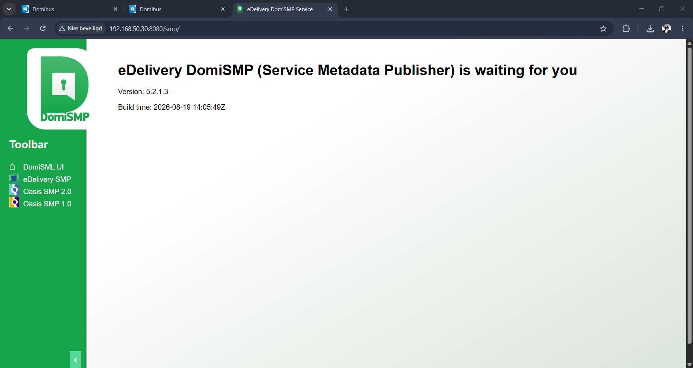
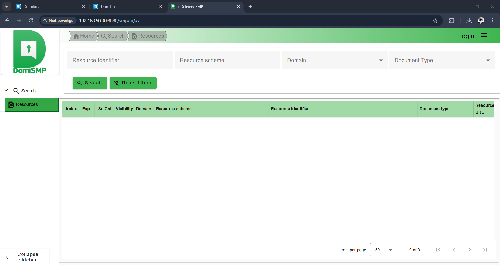
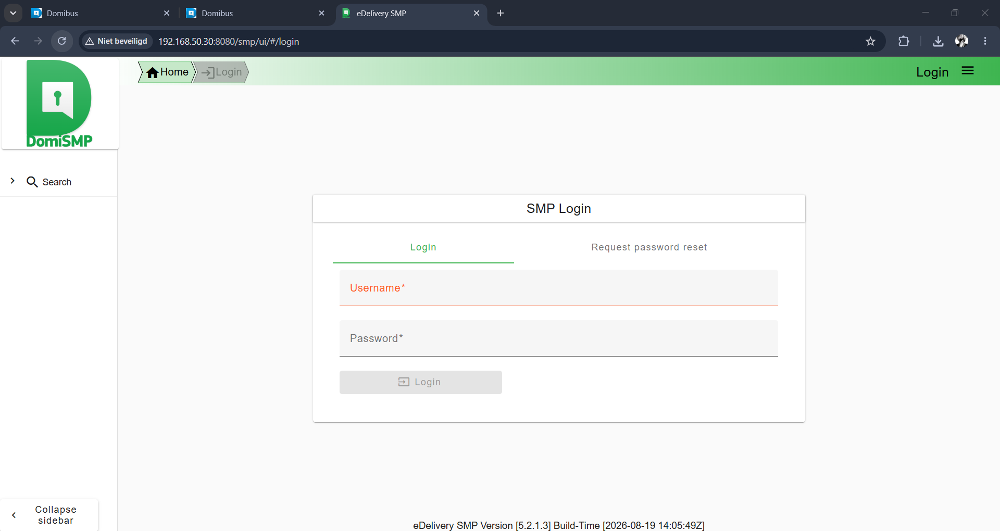
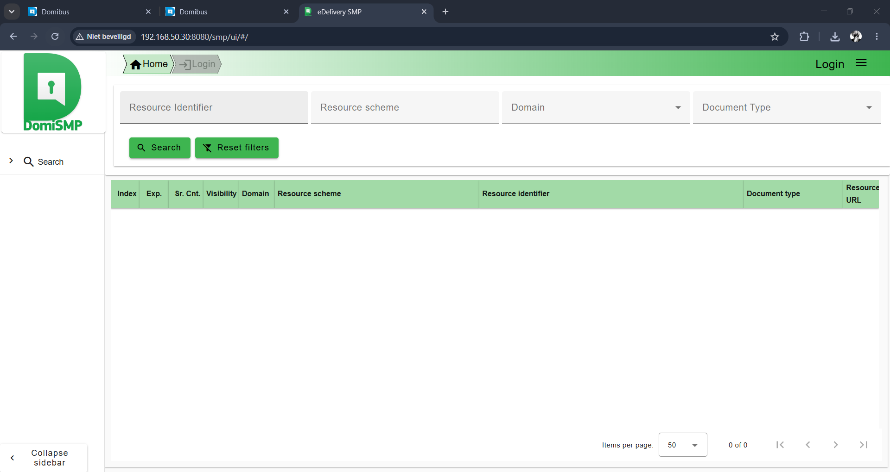

# First start & UI

## Controlled first start

The first startup was performed manually rather than immediately creating a systemd service:

```bash
sudo -u domismp /opt/domismp/bin/startup.sh
```

Observed:

```text
Tomcat started.
```

The Java process was then checked directly, not inferred from an HTTP result:

```text
user: domismp
command: ... org.apache.catalina.startup.Bootstrap start
heap: -Xms1024m -Xmx2048m
```

Port ownership:

```text
*:8080 owned by java
```

## First deployment result

Tomcat expanded the WAR to `/opt/domismp/webapps/smp` and logged:

```text
Deployment of web application archive [/opt/domismp/webapps/smp.war]
has finished in [23,983] ms
```

and:

```text
Server startup in [25116] milliseconds
```

DomiSMP confirmed the JNDI datasource:

```text
User datasource with JNDI: [java:comp/env/jdbc/eDeliverySmpDs]
```

## HTTP behaviour

Initial checks:

```text
GET /       -> HTTP 200
GET /smp/   -> HTTP 200
HEAD /smp/  -> HTTP 401
```

The `HEAD` result was not treated as an application failure because normal browser/GET access returned 200 and the deployment logs were healthy.

## Windows UI proof

The Windows host successfully opened:

```text
http://192.168.50.30:8080/smp/
```

The landing page displayed:

```text
eDelivery DomiSMP (Service Metadata Publisher)
Version: 5.2.1.3
Build time: 2026-08-19 14:05:49Z
```



The public resources UI was also reachable:



## Administrator bootstrap

The setup seed contains `system` and `user` accounts with bcrypt hashes, not plaintext credentials. The current documentation did not make the bootstrap password obvious, so the older documented default was tested **once** to avoid the configured login-suspension threshold.

It worked for:

```text
username: system
role: SYSTEM_ADMIN
```

The vendor bootstrap password was immediately changed to a new private password meeting the observed policy:

```text
16–32 characters
at least one lowercase letter
at least one uppercase letter
at least one digit
at least one special character
must differ from existing password
```

The actual new password is not stored here.



## Seeded objects still present

At this checkpoint, the vendor seed remains present (`testdomain`, test group, OASIS SMP extension). SDK-specific objects had not yet been created.


