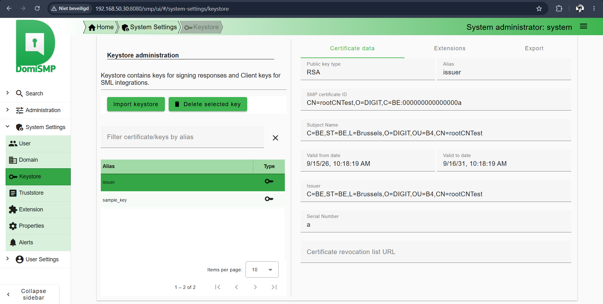
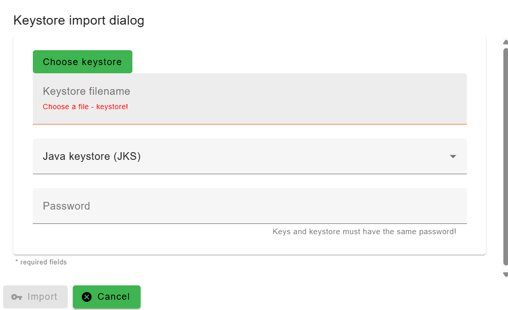
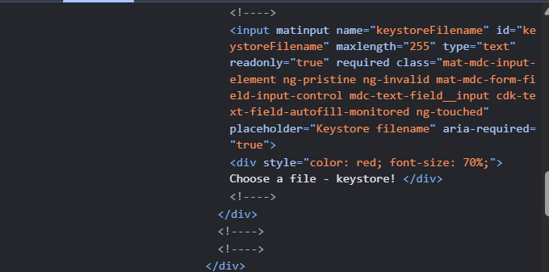
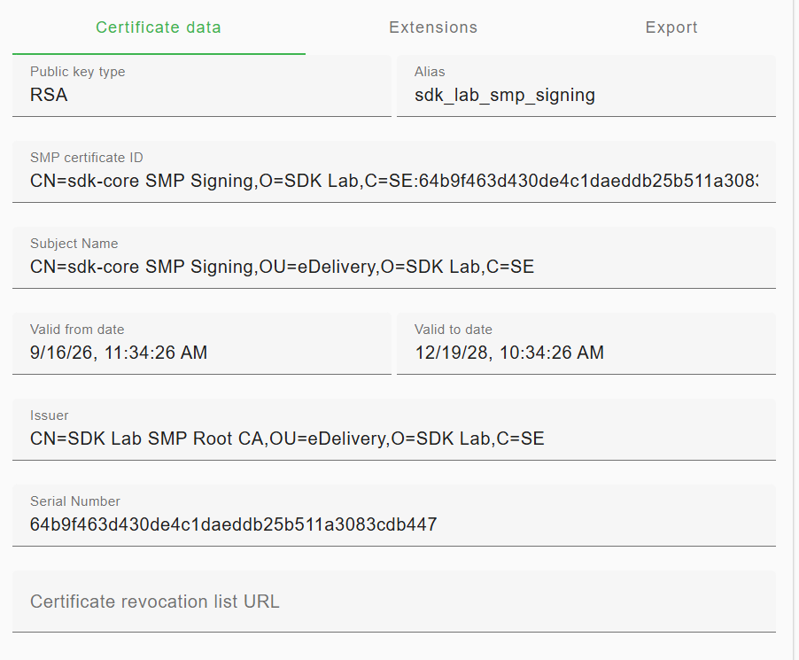
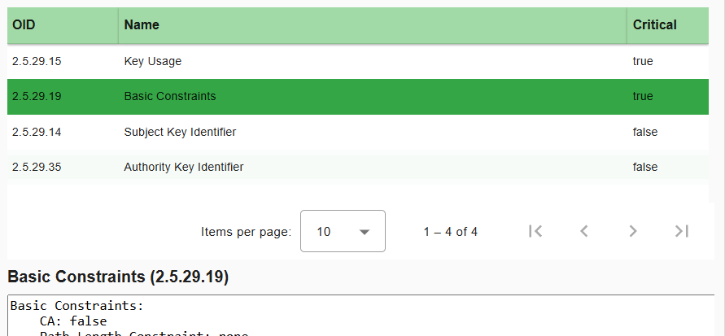

# SMP keystore

## DomiSMP keystore UI before import

The DomiSMP System Settings / Keystore page initially exposed vendor aliases:

```text
issuer
sample_key
```

The UI provided:

- `Import keystore`;
- `Delete selected key`;
- Certificate data;
- Extensions;
- Export.

No key-generation workflow was present in the UI, which is why the key material was prepared externally.




*DomiSMP Keystore page with the vendor aliases issuer and sample_key before the import.*

## Browser file-picker problem

The `Import keystore` dialog had:

```text
Choose keystore
Keystore filename (read-only display)
Keystore type
Password
Import / Cancel
```

The grey filename field was inspected in DevTools and shown to be a read-only text input. It was not a path-entry field.

The actual file upload control was hidden behind the UI. Troubleshooting included checking for `input[type="file"]`, keyboard activation, and inspecting button state. The important lesson was: **do not type a filesystem path into the read-only filename field**.




*The Import keystore dialog; the grey filename field is display-only.*



*DevTools shows the filename field is a read-only text input, not the upload control.*

## Import settings

The import used:

```text
Keystore type: PKCS #12 (PKCS12)
File: E:\VMs\Domibus-Lab\Installers\sdk-lab-smp-signing.p12
```

The export password was entered privately.

## Successful result

DomiSMP displayed the new alias:

```text
sdk_lab_smp_signing
```

Certificate data showed:

```text
Public key type: RSA
Subject: CN=sdk-core SMP Signing, OU=eDelivery, O=SDK Lab, C=SE
Issuer:  CN=SDK Lab SMP Root CA, OU=eDelivery, O=SDK Lab, C=SE
Serial:  64b9f463d430de4c1daeddb25b511a3083cdb447
```

The Extensions tab showed:

```text
Key Usage                    critical=true
Basic Constraints            critical=true
Subject Key Identifier       critical=false
Authority Key Identifier     critical=false
Basic Constraints: CA=false
```

This matched the intended leaf-certificate role.



*Imported sdk_lab_smp_signing certificate: subject, issuer, validity and serial.*



*Leaf certificate extensions: Key Usage and Basic Constraints critical, CA=false.*


## Alias role distinction

`sdk_lab_smp_signing` was created for **SMP response/metadata signing**.

It must not automatically be treated as the **SML client-authentication certificate**. The DomiSMP SML-integration page lists available private keys, but the future SML client identity is a separate trust role.
