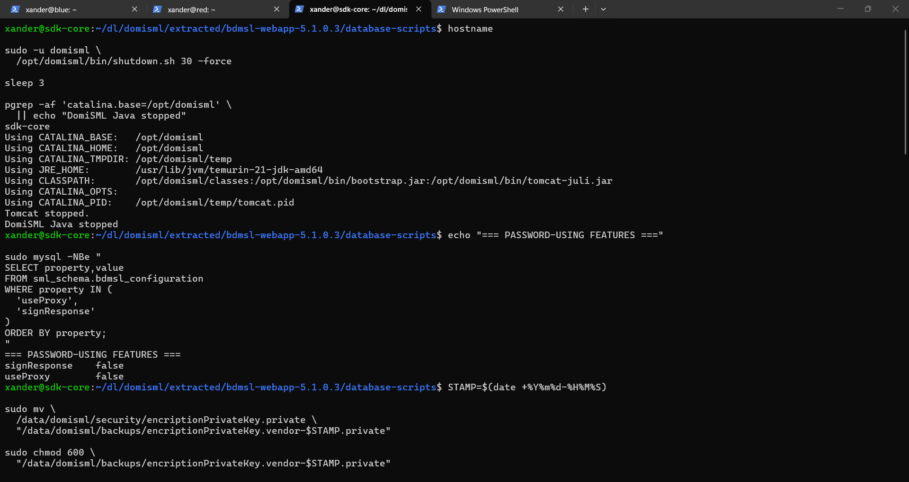
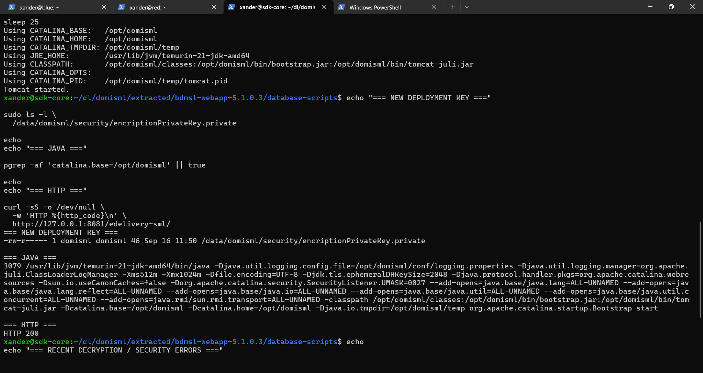
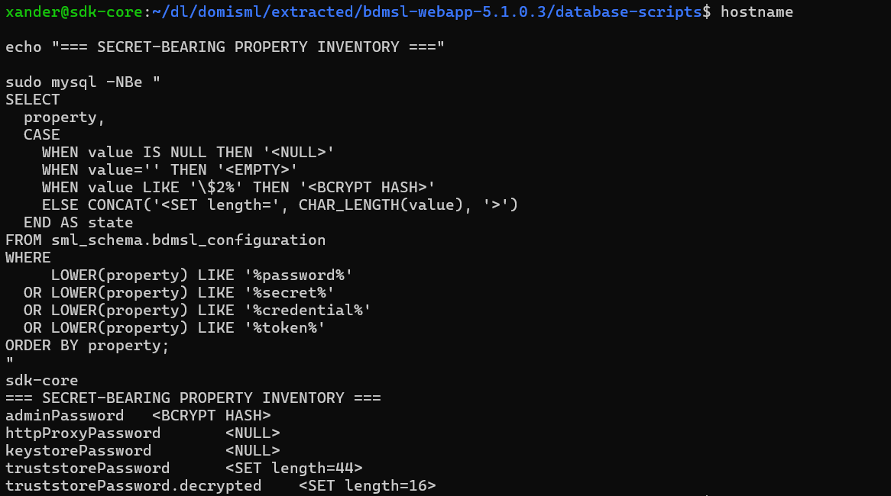
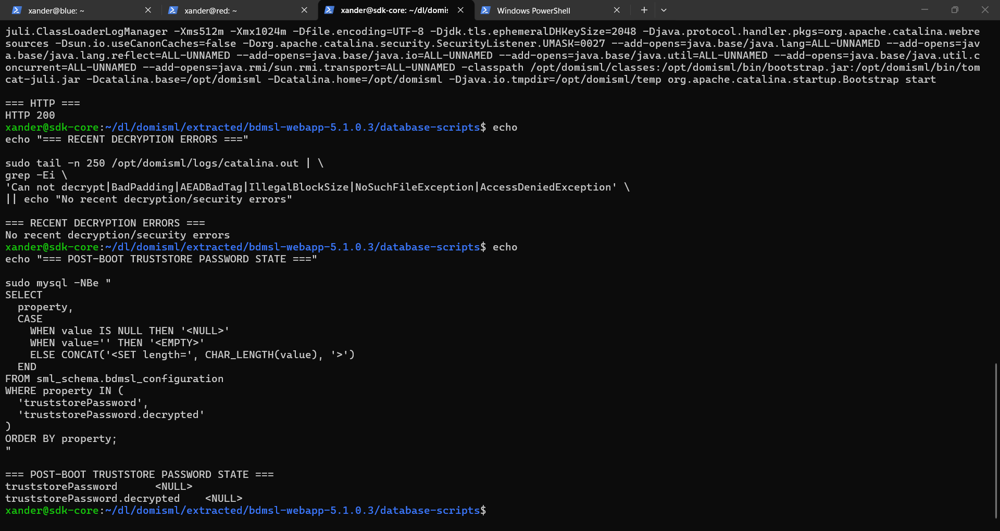

# Security path & keys

## Vendor sample security material

### Initial security material

The vendor setup bundle contained:

```text
encriptionPrivateKey.private
keystore.jks
keystore.p12
truststore.p12
```

The initial approach copied `encriptionPrivateKey.private`, `keystore.jks` and `truststore.p12` into (the database points at the JKS keystore, so `keystore.p12` was not needed):

```text
/data/domisml/security
```

with owner `domisml:domisml` and mode `600`.

This was done so the first boot could start from the vendor baseline while we determined how DomiSML 5.1.0.3 actually resolved security files.

### Database security properties

The database contained, among others:

```text
encriptionPrivateKey = encriptionPrivateKey.private
keystoreFileName     = keystore.jks
keystoreType         = JKS
keystoreAlias        = sendercn
signResponse          = false
```

Password values were inspected only as state/length or redacted values.

### Important distinction

These vendor security files are **not** the final SDK-lab federation trust material. Their purpose in this phase was to get a reproducible local DomiSML baseline and understand the application’s security-property lifecycle.

## First boot and the `/opt/smlconf` path problem

### First manual boot

Before systemd, DomiSML was started manually as the `domisml` user.

Verified:

```text
Java process present
*:8081 listening
WAR exploded to /opt/domisml/webapps/edelivery-sml
HTTP GET /edelivery-sml/ -> 200
```

The first WAR deployment completed in approximately:

```text
17,528 ms
```

Tomcat server startup completed in approximately:

```text
18,609 ms
```

### Problem found in application logs

Despite the classpath property:

```text
sml.security.folder=/data/domisml/security
```

the database still contained:

```text
configurationDir    /opt/smlconf/
sml.security.folder /opt/smlconf/
```

The database values won at runtime.

Symptoms included:

```text
AccessDeniedException: /opt/smlconf
Configuration folder [/opt/smlconf] does not exist and can not create the folder
keystore.jks does not exist under /opt/smlconf
truststore.p12 does not exist under /opt/smlconf
encriptionPrivateKey.private does not exist under /opt/smlconf
Can not decrypt property ... NoSuchFileException
```

### Fix

Both database properties were updated to:

```text
/data/domisml/security
```

After restart, runtime logging showed:

```text
configurationDir        /data/domisml/security
sml.security.folder     /data/domisml/security
```

The path-not-found errors disappeared.

### New problem revealed

Once DomiSML could actually read the vendor encryption key, it produced cryptographic failures instead of file-not-found failures:

```text
IllegalBlockSizeException
BadPaddingException
```

This proved that the sample encrypted values did not match the sample key in a way usable by this deployment.

That led to the next cleanup phase.

## Encryption key and stale vendor secret cleanup

### Why the vendor ciphertext was not preserved as active config

The application had started and HTTP was healthy, but encrypted seed values failed to decrypt with the copied vendor key.

Instead of trying to reverse-engineer or hard-code vendor sample secrets, the lab moved to a deployment-specific encryption key and removed only unused sample ciphertext.

### Preconditions checked

The two features that depended on the obvious sample password fields were confirmed disabled:

```text
signResponse = false
useProxy     = false
```

### Vendor key backup

The copied vendor key was moved out of the active security folder into `/data/domisml/backups` with a timestamped name.

The active path:

```text
/data/domisml/security/encriptionPrivateKey.private
```

was then intentionally absent before the next boot.

### Clearing unused sample password properties

These were set to `NULL`:

```text
httpProxyPassword
keystorePassword
```

The actual values were never reproduced in this documentation.




*DomiSML stopped; signResponse and useProxy confirmed false; vendor key moved to backups.*

### Deployment-specific key generation

On the next boot DomiSML generated a new key automatically at:

```text
/data/domisml/security/encriptionPrivateKey.private
```

Observed properties:

```text
owner: domisml:domisml
size: 46 bytes (observed on this build)
```

Java stayed running and HTTP remained 200.



*New 46-byte deployment key created by DomiSML; Java running and HTTP 200.*


### One remaining ciphertext

A safe inventory query showed:

```text
adminPassword                 <BCRYPT HASH>
httpProxyPassword             <NULL>
keystorePassword              <NULL>
truststorePassword            <SET length=44>
truststorePassword.decrypted  <SET length=16>
```

The remaining runtime error was an AEAD tag mismatch, consistent with stale encrypted truststore-password metadata.




*Safe inventory: only states and lengths of secret-bearing properties are printed, never values.*

### Preserving before clearing

The rows for:

```text
truststorePassword
truststorePassword.decrypted
```

were dumped with `mysqldump` into a restricted timestamped backup under:

```text
/data/domisml/backups/
```

The backup was mode `600` and was not printed to the screen.

### Final cleanup

Both truststore password properties were set to `NULL`.

After restart:

```text
Java running
HTTP 200
No recent decrypt/security errors
truststorePassword             <NULL>
truststorePassword.decrypted   <NULL>
```




*After restart: no decryption/security errors, and both truststore password properties are NULL.*

The physical `truststore.p12` file was left in place for the baseline, but the stale vendor password metadata was no longer active.

### `adminPassword`

The admin password property was a BCrypt hash and was explicitly **not** treated as encrypted ciphertext and not cleared.
