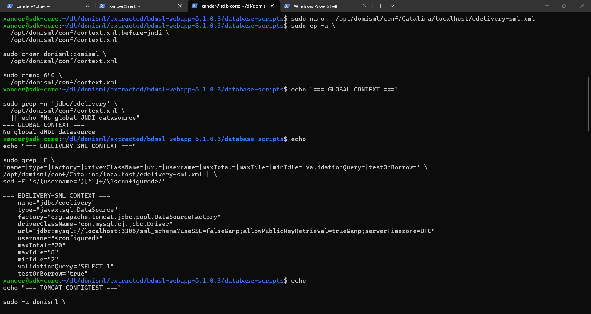
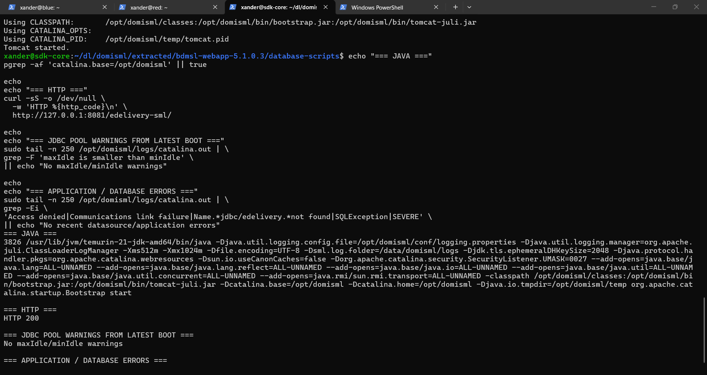

# JNDI

## Initial JNDI configuration

The first datasource was added to Tomcat's global:

```text
/opt/domisml/conf/context.xml
```

with JNDI name:

```text
jdbc/edelivery
```

matching application lookup:

```text
java:comp/env/jdbc/edelivery
```

The JDBC URL included:

```text
jdbc:mysql://localhost:3306/sml_schema?useSSL=false&allowPublicKeyRetrieval=true&serverTimezone=UTC
```

The DB password is redacted.

## Warning found

Tomcat emitted:

```text
maxIdle is smaller than minIdle, setting maxIdle to: 10
```

and the warning appeared while multiple default Tomcat webapps were being deployed.

This exposed a second design issue: a datasource in global `context.xml` is inherited by every webapp.

## Better design

The datasource was moved to an application-specific context:

```text
/opt/domisml/conf/Catalina/localhost/edelivery-sml.xml
```

The clean pre-JNDI global context was restored.

Verification:

```text
No global JNDI datasource
```

## Final pool settings

The app-scoped datasource uses:

```text
maxTotal=20
maxIdle=8
minIdle=2
maxWaitMillis=10000
validationQuery=SELECT 1
testOnBorrow=true
```

## Final sanitized form

```xml
<Context>
  <Resource
      name="jdbc/edelivery"
      auth="Container"
      type="javax.sql.DataSource"
      factory="org.apache.tomcat.jdbc.pool.DataSourceFactory"
      driverClassName="com.mysql.cj.jdbc.Driver"
      url="jdbc:mysql://localhost:3306/sml_schema?useSSL=false&amp;allowPublicKeyRetrieval=true&amp;serverTimezone=UTC"
      username="sml_dbuser"
      password="<REDACTED_DB_PASSWORD>"
      maxTotal="20"
      maxIdle="8"
      minIdle="2"
      maxWaitMillis="10000"
      validationQuery="SELECT 1"
      testOnBorrow="true"
  />
</Context>
```




*App-scoped edelivery-sml.xml (username masked) and the restored global context without a datasource.*

## Result

After restart:

```text
HTTP 200
No maxIdle/minIdle warnings
No recent datasource/application errors
```



*After the restart: HTTP 200, no maxIdle/minIdle warning, no datasource or application errors.*
