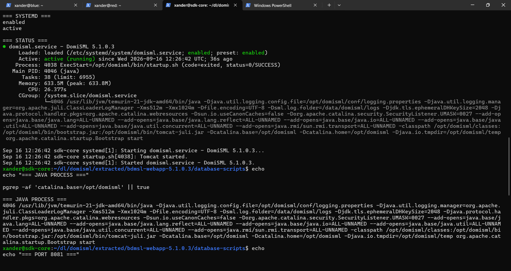
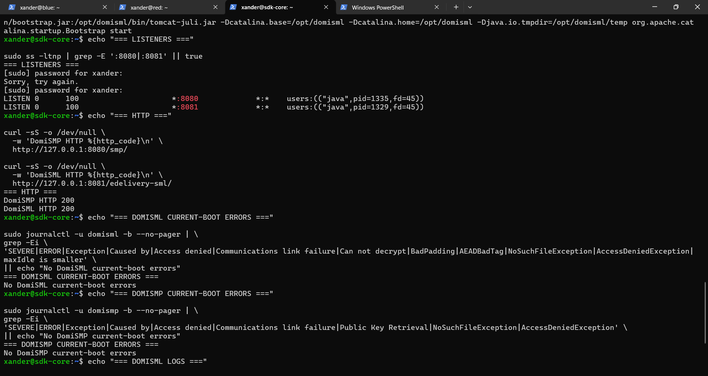

# systemd & reboot

## DomiSML systemd service

After the manual runtime was clean, DomiSML was moved under systemd.

### Final unit

```ini
[Unit]
Description=DomiSML 5.1.0.3
After=network-online.target mysql.service
Wants=network-online.target
Requires=mysql.service
RequiresMountsFor=/data

[Service]
Type=forking

User=domisml
Group=domisml
WorkingDirectory=/opt/domisml

Environment=JAVA_HOME=/usr/lib/jvm/temurin-21-jdk-amd64
Environment=CATALINA_HOME=/opt/domisml
Environment=CATALINA_BASE=/opt/domisml
Environment=CATALINA_PID=/opt/domisml/temp/tomcat.pid

ExecStart=/opt/domisml/bin/startup.sh
ExecStop=/opt/domisml/bin/shutdown.sh 30 -force

PIDFile=/opt/domisml/temp/tomcat.pid

Restart=on-failure
RestartSec=10

TimeoutStartSec=180
TimeoutStopSec=60

LimitNOFILE=65536
UMask=0027

[Install]
WantedBy=multi-user.target
```

Location:

```text
/etc/systemd/system/domisml.service
```

!!! note "Difference from domismp.service"
    `domismp.service` also lists `data.mount` in `After=`. `domisml.service` doesn't, but `RequiresMountsFor=/data` already makes systemd wait for the `/data` mount, so both units start in the correct order.

### Verification

`systemd-analyze verify` produced no complaint.

Then:

```text
systemctl enable domisml
systemctl start domisml
```

Validation showed:

```text
enabled
active
Main PID -> Java
:8081 -> Java
GET /edelivery-sml/ -> HTTP 200
```

`journalctl -u domisml -b -p warning` returned no unit warnings at this point. (That only covers systemd's own messages; Tomcat logs go to `catalina.out`, see below.)



*domisml.service active (running), Main PID 4046 is Java with -Dsml.log.folder set.*


### Health philosophy

As with DomiSMP, `systemctl is-active` was not considered enough. The validation always included:

```text
systemd state
Java process
listener ownership
HTTP response
application logs
error grep
```

## Cold reboot: DomiSMP and DomiSML together

The final validation was a real VM reboot, not merely service restarts.

### Pre-reboot state

Before reboot:

```text
/data mounted from /dev/sdb1
MySQL enabled + active
DomiSMP enabled + active
DomiSML enabled + active
DomiSMP Java present
DomiSML Java present
:8080 listening
:8081 listening
```

The VM was rebooted with:

```text
sudo reboot
```

SSH disconnected as expected and the user reconnected to `192.168.50.30`.

### Boot identity

Observed after reconnect:

```text
hostname: sdk-core
boot time: 2026-09-16 12:30:09 (system output)
```

### Storage

Observed:

```text
/data -> /dev/sdb1
filesystem ext4
~98G total
~93G available
```

### MySQL

Observed:

```text
active
```

### DomiSMP

Observed:

```text
systemd: enabled
systemd: active
Java PID: 1335 (observed on this boot)
port: *:8080
GET /smp/: HTTP 200
current-boot error grep: none
```

### DomiSML

Observed:

```text
systemd: enabled
systemd: active
Java PID: 1329 (observed on this boot)
port: *:8081
GET /edelivery-sml/: HTTP 200
current-boot error grep: none
```




*After reboot: 8080 and 8081 owned by Java PIDs 1335 and 1329; DomiSMP and DomiSML both HTTP 200.*

!!! warning "How strong is \"current-boot error grep: none\"?"
    The check used during the build searched `journalctl -u domisml` / `-u domismp`. Because Tomcat forks, application errors are written to `catalina.out`, **not** the journal, so that grep would also print "none" if an application had failed. The reboot proof still holds because both apps returned **HTTP 200** and their log files were freshly written. Use the `catalina.out` check in the [Runbook](13-runbook.md#current-boot-errors) for future reboots.

### Logs after reboot

DomiSML:

```text
/data/domisml/logs/domisml.log             populated
/data/domisml/logs/domisml-business.log    present
/data/domisml/logs/domisml-security.log    present
```

DomiSMP:

```text
/data/domismp/logs/edelivery-smp.log        populated
```

### Result

```text
COLD REBOOT PROOF: PASS
```

Both Java applications, databases, mounts, ports, and HTTP endpoints recovered without manual intervention.
